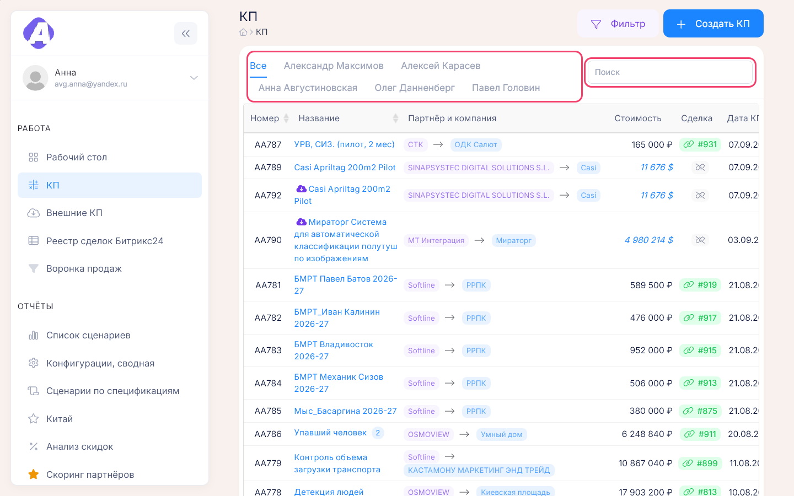
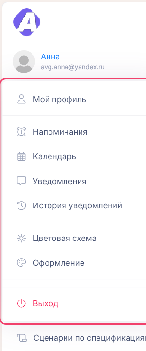

# Начало работы

**Где найти:** портал открывается в браузере; после входа — [«Рабочий стол»](02-desktop.md).
Здесь то, что одинаково во всех разделах: вход, как найти раздел и запись, как понять, что
действие выполнено, и работа с телефона.

## Войти в портал

Логин и пароль выдаёт администратор портала. Отметьте «Запомнить меня», чтобы на этом
устройстве не вводить пароль каждый раз. После входа откроется «Рабочий стол» или страница,
по ссылке на которую вы пришли.

Если вход не проходит:

- «Пользователь не существует» — ошибка в логине; проверьте раскладку клавиатуры.
- «Неправильный пароль!» — проверьте раскладку и Caps Lock. Восстановить пароль самостоятельно
  нельзя — обратитесь к администратору.

## Найти нужный раздел

Разделы левого меню сгруппированы по задачам: «Работа» — ежедневная работа с КП и сделками,
«Отчёты» — сводки и выгрузки, «Справочники» — партнёры, компании и прайс.

<table>
<thead>
<tr><th>Раздел</th><th>Пункт</th><th>Адрес</th><th>Зачем идти</th><th>Подробнее</th></tr>
</thead>
<tbody>
<tr><td rowspan="5">«Работа»</td><td>«Рабочий стол»</td><td><code>/desktop</code></td><td>свои показатели и быстрые ссылки на одной странице</td><td><a href="02-desktop.md">02-desktop.md</a></td></tr>
<tr><td>«КП»</td><td><code>/proposals</code></td><td>создать, найти и отправить КП</td><td><a href="03-proposals.md">03-proposals.md</a></td></tr>
<tr><td>«Внешние КП»</td><td><code>/external-proposals</code></td><td>перенести КП из генератора OSMOVIEW CP</td><td><a href="04-external-proposals.md">04-external-proposals.md</a></td></tr>
<tr><td>«Реестр сделок Битрикс24»</td><td><code>/bitrix/deal</code></td><td>привязать КП к сделке, завести проект, выгрузить сделки</td><td rowspan="2"><a href="05-bitrix-deals.md">05-bitrix-deals.md</a></td></tr>
<tr><td>«Воронка продаж»</td><td><code>/bitrix/dashboard</code></td><td>сводка сделок по стадиям, странам, менеджерам</td></tr>
<tr><td rowspan="11">«Отчёты»</td><td>«Список сценариев»</td><td><code>/report/scenarios</code></td><td>какие сценарии есть в прайсе</td><td rowspan="7"><a href="11-reports.md">11-reports.md</a></td></tr>
<tr><td>«Конфигурации, сводная»</td><td><code>/report/specs</code></td><td>что входит в спецификации</td></tr>
<tr><td>«Сценарии по спецификациям»</td><td><code>/report/scenarios_specs</code></td><td>какие сценарии купил клиент</td></tr>
<tr><td>«Китай»</td><td><code>/report/china</code></td><td>отчёт по ключам для китайского направления</td></tr>
<tr><td>«Анализ скидок»</td><td><code>/analytics/discounts</code></td><td>КП со скидкой выше нормы</td></tr>
<tr><td>«Скоринг партнёров»</td><td><code>/analytics/partners</code></td><td>отчёт по партнёрам: балл, КП, сделки, платежи</td></tr>
<tr><td>«Расхождения с Битрикс24»</td><td><code>/crm-monitor</code></td><td>где данные портала и CRM не сходятся</td></tr>
<tr><td>«Договоры и оплаты»</td><td><code>/report/payments</code></td><td>оплаты по спецификациям, выгрузка в Excel</td><td rowspan="2"><a href="09-contracts-payments.md">09-contracts-payments.md</a></td></tr>
<tr><td>«Платёжный календарь»</td><td><code>/payment-calendar</code></td><td>план поступлений и просрочка</td></tr>
<tr><td>«Ключи»</td><td><code>/report/license_keys</code></td><td>все лицензионные ключи</td><td rowspan="2"><a href="10-licenses.md">10-licenses.md</a></td></tr>
<tr><td>«Реестр лицензий»</td><td><code>/analytics/licenses</code></td><td>какие лицензии скоро истекают</td></tr>
<tr><td rowspan="6">«Справочники»</td><td>«Нейросервисы»</td><td><code>/neuroservice</code></td><td>цены и состав нейросервисов</td><td rowspan="2"><a href="12-references.md">12-references.md</a></td></tr>
<tr><td>«Сценарии»</td><td><code>/scenario</code></td><td>цены и состав сценариев</td></tr>
<tr><td>«Компании»</td><td><code>/companies</code></td><td>заказчики, их спецификации и ключи</td><td><a href="08-companies.md">08-companies.md</a></td></tr>
<tr><td>«Партнёры»</td><td><code>/partners</code></td><td>партнёры, договоры, сделки партнёра</td><td><a href="07-partners.md">07-partners.md</a></td></tr>
<tr><td>«Работы»</td><td><code>/works</code></td><td>услуги из прайса</td><td rowspan="2"><a href="12-references.md">12-references.md</a></td></tr>
<tr><td>«ПО»</td><td><code>/softwares</code></td><td>программные продукты из прайса</td></tr>
</tbody>
</table>

Нет нужного пункта в меню — у вас нет права на этот раздел; обратитесь к администратору.
Раздел «Настройки» служебный и виден не всем.

Ссылку на страницу из адресной строки можно отправить коллеге. В «Реестре сделок Битрикс24»
и в журнале изменений в ссылку попадают и выбранные вкладка с фильтром.

## Найти запись в списке

- Знаете номер или часть названия — введите их в «Поиск» над таблицей.
- Нужна выборка по партнёру, компании, статусу, датам — «Фильтр». Число на кнопке — сколько
  условий включено, «Убрать» сбрасывает все.
- В списке КП вкладки над таблицей отбирают КП одного менеджера.

Фильтр списка КП запоминается: вернувшись в список в течение суток, вы увидите ту же выборку.
Если строк меньше, чем ожидали, проверьте число на кнопке «Фильтр» и выбранную вкладку.

## Понять, что действие выполнено

- Зелёное сообщение «Это успех!» — изменения сохранены.
- Красное «Это провал!» — действие не выполнено, в тексте причина. Исправьте и повторите.
- Экран затемнился и крутится индикатор — идёт долгая операция (формирование PDF, выгрузка):
  дождитесь конца и не обновляйте страницу.

## Выйти или сменить тему

Всё, что относится к вашей учётной записи, спрятано под аватаром в левом меню: профиль,
напоминания, календарь, уведомления, цветовая схема и выход.

Цветовая схема запоминается в браузере — на другом компьютере её нужно выбрать заново.

## Работать с телефона

Меню открывается кнопкой ☰ в верхней полосе, широкие таблицы прокручиваются вбок. Рабочий стол
с телефона можно смотреть, но не настраивать — перестановка и добавление виджетов работают
только на широком экране.

## Узнать, кто изменил карточку

На карточках КП, партнёра и компании кнопка «Журнал изменений» показывает, кто, когда и что
поменял, и открывает карточку на прошлую дату — см. [14-entity-log.md](14-entity-log.md).
Если над карточкой жёлтая полоса «Просмотр состояния на …» — это слепок из прошлого: изменить
его нельзя, к текущему состоянию возвращает крестик на полосе.

## Частые вопросы

- **Не могу войти.** — Проверьте раскладку и Caps Lock. Пароль восстанавливает только
  администратор портала.
- **Почему у меня нет раздела в меню?** — Нет права на раздел; обратитесь к администратору.
- **Где кнопка выхода?** — Аватар в левом меню → «Выход».
- **Как включить тёмную тему?** — Аватар → «Цветовая схема» → «Тёмная».
- **Меню свернулось до значков.** — Нажмите кнопку со стрелками рядом с логотипом.
- **Таблица показывает не все строки.** — Проверьте число на кнопке «Фильтр», вкладку менеджера
  и количество строк на странице под таблицей.
- **Что за точка на аватаре?** — Непрочитанные уведомления: аватар → «Уведомления».
- **Можно ли отменить сохранённое изменение?** — Кнопки отмены нет. Что было до правки, покажет
  журнал изменений карточки; верните значения вручную.
