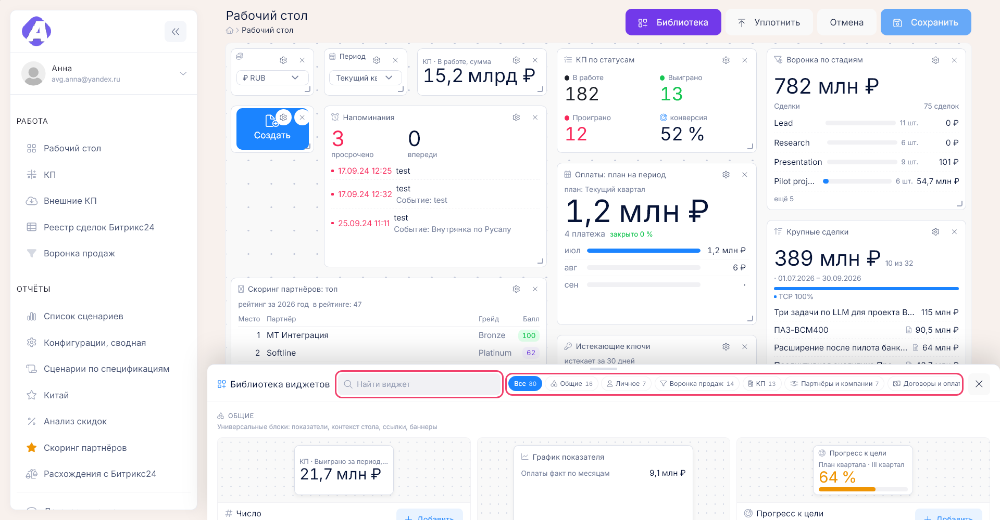
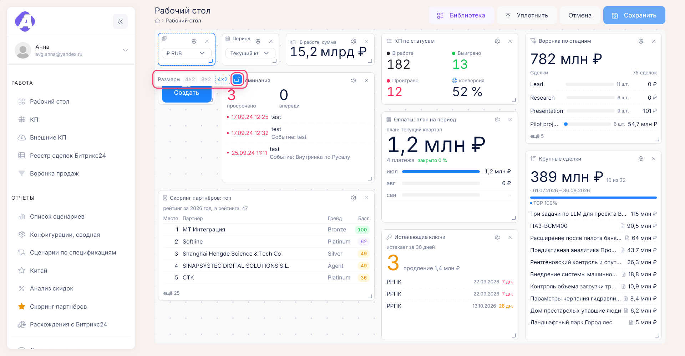

# Рабочий стол

**Где найти:** «Работа» → «Рабочий стол» (`/desktop`). Это главная страница портала: она открывается
после входа и по логотипу.
Стол — ваша панель из [виджетов](00-glossary.md): цифры, списки и графики из разных разделов на одном
экране. Столов может быть несколько. Настраивать стол можно только на широком экране.

## Добавить виджет на стол

1. «Редактировать» → «Библиотека».
2. Найдите виджет поиском или на вкладке его категории. Превью в карточке показывает виджет на примере.
3. «Добавить» ставит виджет в первое свободное место, чип размера — сразу в этом размере. Можно
   и перетащить превью в нужное место стола.
4. Закройте библиотеку и нажмите «Сохранить».

Если виджету нужен параметр — например, какое КП показывать, — сразу откроются его настройки.
Подобрать виджет под задачу поможет раздел «Какой виджет поставить».

## Переставить виджет или изменить размер

«Редактировать», затем:

- перетащите блок мышью — соседи раздвинутся;
- потяните за правый нижний угол — размер меняется шагами, которые предусмотрел виджет. Нужен другой
  размер — на панели «Размеры» под блоком откройте замок, и блок можно растянуть как угодно;
- «Уплотнить» поднимет все блоки вверх и уберёт пустые места.

После перестановки нажмите «Сохранить».

## Настроить, что показывает виджет

«Редактировать» → шестерёнка на блоке. В «Данных» выбирают, что показывать: показатель, КП, партнёра,
менеджера, период, валюту. В «Оформлении» — заголовок, заливку, размер шрифта. «Применить», затем
«Сохранить».

Текст виджета «Заметка» меняется двойным щелчком прямо в режиме просмотра и сохраняется сразу.

## Поменять валюту и период для всех виджетов

Поставьте на стол виджеты «Выбор валюты» и «Период» и выберите значения. Денежные виджеты
пересчитаются по курсу на дату операции, виджеты с периодом «со стола» покажут выбранный период.

Выбор действует до конца сеанса. Чтобы стол всегда открывался с ним, нажмите «Редактировать» →
«Сохранить». Без выбора стол считает в рублях за текущий квартал. Виджет, у которого в настройках
задана своя валюта или свой период, выбор стола не меняет.

## Завести ещё один стол

Кнопка с названием стола → «Новый стол». Чтобы не собирать стол с нуля, включите «Скопировать текущий
стол». В том же меню — копирование, переименование и удаление стола.

«Сделать основным» — стол станет открываться после входа.

## Сделать свой стол из системного

Системный пресет — стол-образец, который собирает администратор; он виден всем в меню столов.
Менять пресет нельзя, поэтому на нём плашка «только просмотр». Нажмите «Сделать своим» — появится
ваша копия, которую можно настраивать.

Когда администратор обновит пресет, на столах, скопированных из него, появится плашка: «Применить
обновление» заменит вашу раскладку новой, «Оставить как есть» сохранит вашу.

## Убрать виджет

«Редактировать» → крестик на блоке → «Сохранить».

## Вернуть стол как было

- Изменения ещё не сохранены — «Отмена»: стол вернётся к сохранённому виду.
- Уже сохранили — удалённый виджет придётся добавить заново и настроить.
- Нужен стол «как у всех» — откройте системный пресет в меню столов и нажмите «Сделать своим».

## Как это устроено

- **Изменения записываются только кнопкой «Сохранить».** До этого они живут в браузере; при попытке
  уйти со страницы с несохранёнными изменениями браузер предупредит.
- **Редактировать можно только на широком экране**, когда стол занимает 32 колонки. На узком экране
  и телефоне стол можно только смотреть.
- **Размеры:** закрытый замок разрешает только размеры, предусмотренные виджетом, открытый — любые.
  Закроете замок снова — блок примет ближайший разрешённый размер. Содержимое подстраивается под
  размер: в маленьком блоке остаётся главное, в большом добавляются подписи, графики и строки.
- **«Виджет «…» недоступен»** — у вас нет права на данные виджета или его убрали из портала.
  «Не удалось загрузить виджет» — временная ошибка, нажмите «Повторить».
- **Не все виджеты есть в библиотеке:** «Журнал изменений» видят только с правом на журнал,
  финансовые виджеты — с доступом к платёжному календарю.
- **Стрелка в заголовке блока** ведёт на страницу раздела, откуда виджет берёт данные.
- **Новый сотрудник** при первом входе получает копию системного пресета по умолчанию. Если удалить
  все свои столы, при следующем входе стол создастся так же.
- **Если удалить основной стол**, основным станет первый из оставшихся.

## Какой виджет поставить

Виджеты по категориям библиотеки: что показывает каждый и куда из него можно перейти. Категорию
«Администрирование» видит только администратор портала, здесь она не описана.

### Общие

| Виджет | Что показывает | Куда ведёт |
|---|---|---|
| «Число» | Один показатель крупно (сумма сделок, КП в работе, факт оплат, истекающие ключи, число партнёров…), изменение к прошлому периоду. Пересчитывается при смене валюты и периода стола | На страницу-источник показателя: [КП](03-proposals.md), [сделки](05-bitrix-deals.md), [оплаты](09-contracts-payments.md), [ключи](10-licenses.md), [партнёры](07-partners.md) |
| «График показателя» | График любого показателя: линия, столбцы или область; день / неделя / месяц / квартал; вторая линия — прошлый год | Страница-источник показателя |
| «Прогресс к цели» | Факт к плану в процентах (цель — число или константа портала). Цвет: серый до 50 %, жёлтый до 90 %, дальше зелёный | Страница-источник показателя |
| «Сравнение периодов» | Два значения показателя за периоды A и B и разница в процентах и абсолюте | Страница-источник показателя |
| «Курсы валют» | Курс ЦБ на сегодня по выбранным валютам и изменение ко вчерашнему дню. Курс старше 2 дней помечен предупреждением | — |
| «Выбор валюты» | Переключатель валюты стола (см. «Поменять валюту и период для всех виджетов») | — |
| «Период» | Переключатель периода стола | — |
| «Быстрая ссылка» | Плитка-закладка на объект: КП, партнёр, компания, сделка Битрикс24, спецификация, проект, страница портала или внешний адрес; второй строкой — статус и сумма, грейд | На карточку объекта |
| «Набор ссылок» | До 12 закладок плитками или списком | На карточки объектов |
| «Баннер» | Статичный блок на всю ширину: заголовок, текст, фон, кнопка со ссылкой. Удобен для объявлений в системном пресете | По кнопке баннера |
| «Заголовок ряда» | Подпись ряда виджетов («Финансы», «Мои КП») высотой в одну ячейку | — |
| «Кто в сети» | Коллеги, которые были на портале за последние 10 минут | — |
| «Журнал изменений» | Последние события по КП, партнёрам, компаниям, договорам, спецификациям, оплатам: событие, объект, кто и когда. Можно ограничить одним объектом или «только мои изменения». Только с правом «Видит журнал изменений» | В [ленту изменений](14-entity-log.md) объекта |
| «Заметки по компаниям» | Последние записи журнала переговоров с датой, компанией и КП; кнопка «+» — быстрая заметка | — |
| «Действие» | Одна кнопка — одно действие: «Создать КП», «Новая компания», «Новый партнёр», «Заметка в блокнот», «Выгрузить реестр сделок», «Реестр сделок Битрикс24», «Платёжный календарь» или «Свой адрес»; при желании с подтверждением | На выбранную страницу или попап |
| «Внешняя страница» | Встроенная внешняя страница (дашборд Битрикс24, отчёт Метрики) с адреса из белого списка администратора | На внешний адрес |

### Личное

| Виджет | Что показывает | Куда ведёт |
|---|---|---|
| «Заметка» | Стикер с текстом (жирный, списки, ссылки) и цветом; правится двойным кликом | — |
| «Блокнот» | Заметки блокнота портала со звёздочкой избранного; «Добавить» открывает форму заметки | [Заметки](13-personal.md) |
| «Напоминания» | Ближайшие напоминания с датой, временем и объектом; просроченные красным; выполнить можно в виджете | [Напоминания](13-personal.md) |
| «Календарь» | События календаря портала: месяц, неделя или список на 7 дней | [Календарь](13-personal.md) |
| «Уведомления» | Последние уведомления, непрочитанные выделены | [Уведомления](13-personal.md) |
| «Часы» | Время в выбранных часовых поясах (до четырёх) или в стране партнёра | — |
| «Обратный отсчёт» | Дней до даты или до конца квартала / года; в день события — «сегодня» | — |

### Воронка продаж

| Виджет | Что показывает | Куда ведёт |
|---|---|---|
| «Таблица воронки» | Стадии сделок Битрикс24 с суммой и количеством по показателю (сделки, лицензии, услуги, разработка, платформа); клик по ячейке — список сделок | [Воронка продаж](05-bitrix-deals.md) |
| «Воронка по стадиям» | Горизонтальные полосы стадий: длина — сумма, подпись — число сделок | [Реестр сделок](05-bitrix-deals.md) с фильтром стадии |
| «Страны × статусы помесячно» | Матрица «страна × статус × месяц» на 3 / 6 / 12 месяцев вперёд с тепловой заливкой и итогами | [Воронка продаж](05-bitrix-deals.md) |
| «Страны × статусы поквартально» | То же по плановым кварталам; сделки без квартала — строка «Не выбрано» | [Воронка продаж](05-bitrix-deals.md) |
| «Менеджеры × статусы поквартально» | Нагрузка менеджеров по кварталам: сумма и число сделок в каждой стадии | [Воронка продаж](05-bitrix-deals.md) |
| «Отрасли» | Сфера деятельности заказчика × менеджер — матрицей или столбцами | [Воронка продаж](05-bitrix-deals.md) |
| «Крупные сделки» | Сделки с суммой, стадией, партнёром, значками проекта и КП | На карточку сделки; «↗» — в Битрикс24 |
| «Карточка сделки» | Мини-карточка одной сделки: стадия, сумма, партнёр и заказчик, квартал плана, КП, проект, спецификации | На [карточку сделки](05-bitrix-deals.md) |
| «Сделки по кварталам» | Суммы по плановым кварталам года; «Не выбрано» с предупреждением | Список сделок квартала |
| «Проблемы в сделках» | Сделки с незаполненными полями (квартал, заказчик, сумма, страна) и причина | На сделку в Битрикс24, [проблемы в сделках](05-bitrix-deals.md) |
| «Расхождения с Битрикс24» | КП, у которых сумма или статус не сходятся со сделкой: счётчики по типам и сумма | [Расхождения с Битрикс24](05-bitrix-deals.md) |
| «Синхронизация Битрикс24» | Дата последней синхронизации и её возраст цветом; кнопка запуска (по правам) | — |
| «Реестр сделок» | Компактный реестр с сортировкой и выбранными колонками; «Все сделки» и Excel | [Реестр сделок](05-bitrix-deals.md) |
| «Проекты по сделкам» | Проекты с суммой сделок, спецификациями и статусом; счётчик «ждут сопоставления» | [Проекты по сделкам](06-deal-projects.md) |

### КП

| Виджет | Что показывает | Куда ведёт |
|---|---|---|
| «КП по статусам» | Сколько КП в работе, выиграно и проиграно, и конверсия | [Список КП](03-proposals.md) с фильтром статуса |
| «Конверсия КП» | Доля выигранных среди завершённых, спарклайн по месяцам, сумма выигранных | [Список КП](03-proposals.md) |
| «Последние КП» | Номер, название, партнёр → компания, сумма основного варианта, статус; новые редакции за неделю подсвечены | [Карточка КП](03-proposals.md) |
| «Мои КП» | КП, где вы менеджер, по давности отправки; старше N дней — жёлтым; смена статуса прямо из виджета | [Карточка КП](03-proposals.md) |
| «КП без сделки» | КП в работе без привязки к сделке Битрикс24; кнопка «Привязать» | [Карточка КП](03-proposals.md) |
| «Сумма КП в работе» | Сумма основных вариантов КП в работе в валюте стола, дельта к прошлому месяцу | [Список КП](03-proposals.md) |
| «Причины проигрыша» | Кольцо долей причин проигрыша с количеством и суммой | Список проигранных КП с этой причиной |
| «Скидки» | Средняя скидка по грейдам партнёров и КП с превышением порога (красные флаги) | [Анализ скидок](11-reports.md) |
| «История цен» | Сумма основного варианта по редакциям одного КП, последнее изменение стрелкой | Попап истории цен [КП](03-proposals.md) |
| «Карточка КП» | Мини-карточка одного КП: статус, сумма, сделка, спецификации, менеджер, дата | [Карточка КП](03-proposals.md) |
| «Внешние КП» | Новые КП из OSMOVIEW CP, ещё не перенесённые в портал; «Перенести» | [Внешние КП](04-external-proposals.md) |
| «КП по менеджерам» | Столбцы по менеджерам, сегменты по статусам: количество, сумма или выигранные | [Список КП](03-proposals.md) с фильтром менеджера |
| «Возраст КП» | Сколько КП «висят» в работе по корзинам давности (до 30, 30–60, 60–90, 90+ дней) | [Список КП](03-proposals.md) |

### Партнёры и компании

| Виджет | Что показывает | Куда ведёт |
|---|---|---|
| «Скоринг партнёров: топ» | Место, партнёр, балл, грейд и изменение к прошлому году | [Скоринг партнёров](11-reports.md), попап статистики партнёра |
| «Карточка партнёра» | Мини-карточка одного партнёра: грейд, компании, договоры, оплаты, сделки, скоринг за год | [Карточка партнёра](07-partners.md) |
| «Партнёры по грейдам» | Доли Gold / Silver / Bronze и количество | [Список партнёров](07-partners.md) с фильтром грейда |
| «Новые партнёры» | Партнёры и компании, появившиеся за период, и кто их создал | Карточка [партнёра](07-partners.md) или [компании](08-companies.md) |
| «Партнёры без Битрикс24» | Партнёры без сопоставления с компаниями Битрикс24; кнопка «Сопоставить» | Форма [партнёра](07-partners.md) |
| «Компании по странам» | Столбцы по странам, секторам или партнёрам: количество или сумма спецификаций | [Список компаний](08-companies.md) с фильтром |
| «Активность партнёра» | Динамика по годам одного партнёра или сравнение до трёх: КП, спецификации, оплаты, сделки | [Карточка партнёра](07-partners.md) |

### Договоры и оплаты

| Виджет | Что показывает | Куда ведёт |
|---|---|---|
| «Оплаты за период» | Сумма фактических оплат за 7 / 30 / 90 дней или период стола, дельта к предыдущему отрезку | [Платёжный календарь](09-contracts-payments.md) |
| «Оплаты: план на период» | Ожидаемые оплаты: партнёр → компания, спецификация, сумма, дата; «скоро» подсвечено | Спецификация на [карточке партнёра](09-contracts-payments.md) |
| «Просроченные оплаты» | Оплаты, у которых план прошёл, а факта нет: сумма, давность корзинами | Спецификация на карточке партнёра |
| «Платёжный календарь» | План и факт по месяцам года столбцами, текущий месяц выделен, итоги года | [Платёжный календарь](09-contracts-payments.md) с выбранным месяцем |
| «Спецификации по статусам» | В работе / подписано / завершено / отменено — счётчики и суммы | Отчёт [«Конфигурации, сводная»](11-reports.md) |
| «Сверка спецификаций» | Спецификации, у которых сумма не сходится с оплатами или КП; уровень расхождения цветом | Спецификация на карточке партнёра |
| «Неподписанные договоры» | Рамочные договоры без отметки о подписании, их спецификации и давность | [Карточка партнёра](07-partners.md) |
| «Оплаты: план и факт» | Сводка отчёта «Договоры и оплаты» по типам договоров: план, факт, остаток | Отчёт [«Договоры и оплаты»](09-contracts-payments.md) |
| «Оплаты по партнёрам» | Кто принёс больше денег за период и доля от общего | [Карточка партнёра](07-partners.md) |

### Ключи и лицензии

| Виджет | Что показывает | Куда ведёт |
|---|---|---|
| «Истекающие ключи» | Число ключей, истекающих в горизонте 30 / 60 / 90 дней, и сумма продления; истёкшие — красным | [Реестр лицензий](10-licenses.md) с этим горизонтом |
| «Реестр лицензий» | Компактный реестр: партнёр → компания, договор и спецификация, сроки, остаток, сумма, состояние цветом | [Реестр лицензий](10-licenses.md) |
| «Продления» | Суммы продлений по горизонтам и число ключей; доля «уже продлено» кольцом | [Реестр лицензий](10-licenses.md) |
| «Ключи по компаниям» | Где сосредоточены активные лицензии: по компаниям, партнёрам или странам | [Карточка компании](08-companies.md), реестр лицензий |
| «Карточка ключа» | Один ключ на контроле: компания, срок, состояние, спецификация | [Реестр лицензий](10-licenses.md) с поиском по ключу |

### Отчёты и аналитика

| Виджет | Что показывает | Куда ведёт |
|---|---|---|
| «Популярные сценарии» | Сценарии (нейросервисы), чаще всего попадающие в спецификации или КП | Отчёт [«Список сценариев»](11-reports.md) |
| «Конфигурации, сводная» | Сводка по конфигурациям и спецификациям: количество, сумма, статусы | Отчёт [«Конфигурации, сводная»](11-reports.md) |
| «Сценарии по спецификациям» | Матрица «сценарий × спецификация»: где какой сценарий закуплен | Отчёт [«Сценарии по спецификациям»](11-reports.md) |
| «Китай: сводка» | Ключевые цифры отчёта по Китаю: ключи, суммы, компании; кнопка формирования отчёта | Отчёт [«Китай»](11-reports.md) |
| «Выгрузка отчёта» | До четырёх кнопок выгрузки в Excel («Конфигурации, сводная», «Договоры и оплаты», таблицы воронки) с датой последней выгрузки | Файл Excel; страница [отчёта](11-reports.md) |

## Частые вопросы

- **Нет кнопки «Редактировать».** — Открыт системный пресет или чужой стол: нажмите «Сделать своим»
  или переключитесь на свой стол. На узком экране редактирование не включится.
- **Как вернуть стол «как было у всех»?** — Меню столов → системный пресет → «Сделать своим».
- **Что за замок на панели размеров?** — Закрытый — только размеры, предусмотренные виджетом,
  открытый — любой размер.
- **В библиотеке нет виджета «Журнал изменений».** — Нужно право на журнал; финансовым виджетам
  нужен доступ к платёжному календарю.
- **Поменял валюту, а после входа снова рубли.** — Выбор действует до конца сеанса; чтобы запомнить
  его, «Редактировать» → «Сохранить». Валюта и период у каждого стола свои.
- **Виджет пишет «недоступен».** — Нет права на его данные или виджет убрали; удалите блок или
  обратитесь к администратору.
- **Как вернуть удалённый виджет?** — До сохранения — «Отмена»; после — добавить заново из библиотеки.
- **Сколько столов можно завести?** — Сколько угодно; основной отмечен звёздочкой в меню столов.
