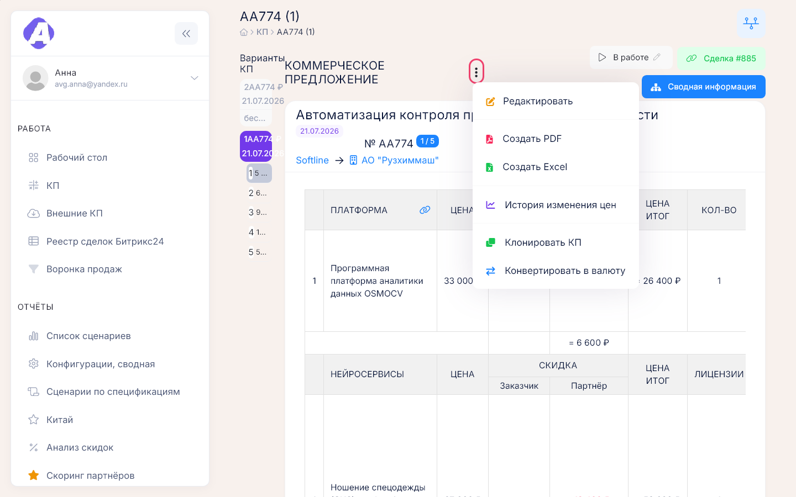
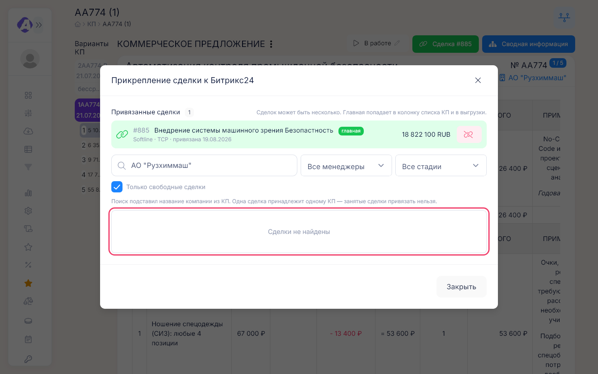
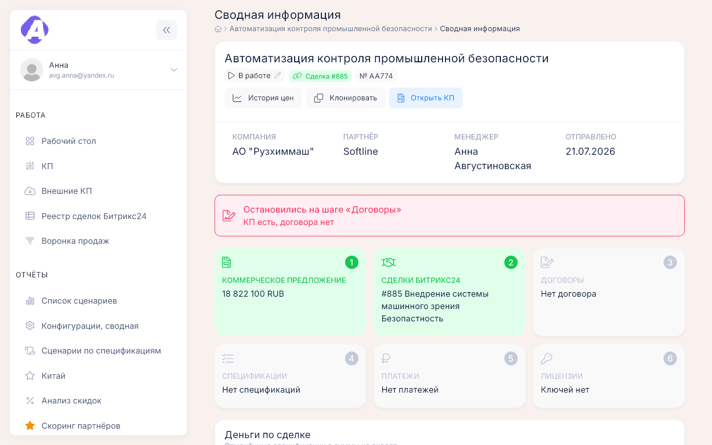
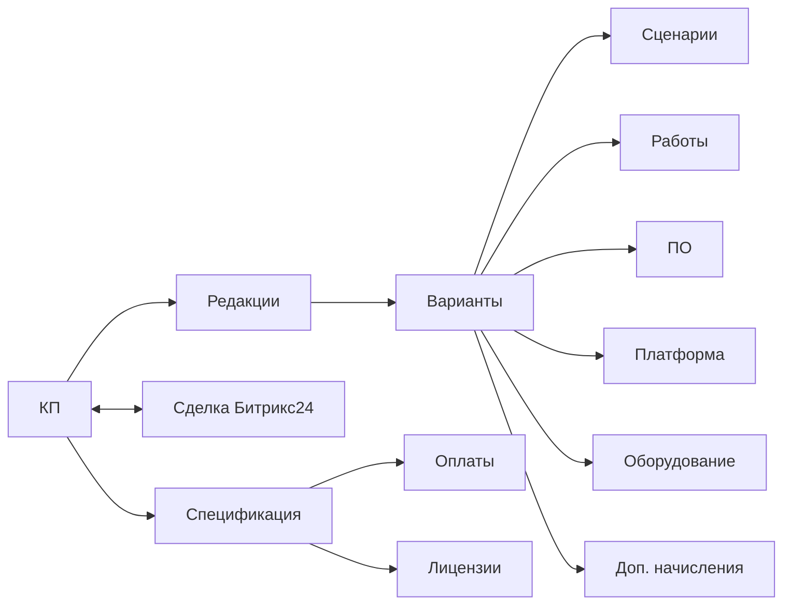

# КП

**Где найти:** «Работа» → «КП» (`/proposals`).
[КП](00-glossary.md) — расчёт решения для заказчика. От него идёт вся цепочка: сделка Битрикс24 →
договор → спецификация → оплаты → лицензии. Здесь КП создают, считают, отправляют заказчику
и ведут до выигрыша или проигрыша.

## Создать КП

1. «Работа» → «КП» → «Создать КП».
2. Выберите менеджера — номер КП подставится сам: инициалы менеджера и следующий номер. Укажите
   партнёра и компанию-заказчика.
3. Задайте варианты — столбцы расчёта: тип («Пилот», «Годовая», «Безлимит») и число периодов.
   Отметьте основной вариант: его сумма идёт в списки, отчёты и сверку со сделками.
4. Добавьте позиции: платформу, сценарии, ПО, работы. Позиции общие для всех вариантов, а количество,
   цена и скидки у каждого варианта свои. Внизу задайте скидки партнёру по каждому варианту.
5. «Создать».

Цены подставляются из [справочников](12-references.md); цену платформы можно задать вручную, щёлкнув
по ней. Позицию можно выключить из расчёта флажком слева или убрать только из одного варианта флажком
в его ячейке. У сценария можно задать альтернативное название (значок «T») — в КП оно заменит название
из справочника.

Новое КП всегда в рублях; расчёт в другой валюте — см. «Пересчитать КП в другую валюту».

## Изменить КП или сделать новую редакцию

Карточка КП → «⋮» → «Редактировать».

- С флажком «Создать новую версию» сохранится новая редакция, а прежняя останется в списке редакций
  слева. Так делают, когда отправленную заказчику версию нужно сохранить.
- Без флажка изменится текущая редакция.

## Отправить КП заказчику в PDF

1. «⋮» → «Создать PDF» → отметьте варианты, у каждого укажите название, число камер и сроки поставки;
   выберите язык и шаблон.
2. «Создать» — в новой вкладке откроется печатная форма. Текст на ней можно поправить прямо на странице.
3. Сохраните PDF через печать браузера → «Сохранить как PDF». Имя файла подставится само: партнёр,
   компания, номер и дата КП.

Шаблон «Со скидкой клиента» показывает цены уже со скидкой заказчика и не раскрывает скидку партнёра.
«Выводить неактивные записи» добавит в форму выключенные позиции. Поправленную форму можно сохранить
кнопкой «Сохранить черновик» и затем вставить в другое КП через «Загрузить черновик».

## Выгрузить КП в Excel

«⋮» → «Создать Excel» → отметьте варианты → «Создать». Каждый вариант окажется на своём листе.

## Пересчитать КП в другую валюту

«⋮» → «Конвертировать в валюту» → валюта и курс → «Создать». Появится новая редакция в этой валюте
со всеми позициями, пересчитанными по курсу; рублёвая редакция останется.

## Скопировать КП для другого заказчика

«⋮» → «Клонировать КП» → название, номер, компания, партнёр, менеджер → «Склонировать».

Копия — отдельное КП с первой редакцией: позиции, скидки и дополнительные начисления переносятся,
а статус, сделки, договоры, спецификации и платежи — нет.

## Сменить статус КП

Кнопка статуса в шапке карточки → «В работе», «Выиграно» или «Проиграно». Для проигрыша причина
обязательна — по причинам строится аналитика проигрышей.

«Выиграно» ставится и само, когда КП в работе прикрепляют к спецификации договора; проигранное КП
при этом не меняется — [09-contracts-payments.md](09-contracts-payments.md).

## Привязать КП к сделке Битрикс24

Кнопка сделки в шапке карточки («Нет сделки» или «Сделка #N») или плашка в колонке «Сделка» списка →
найдите сделку → «Привязать». Поиск сразу подставляет компанию КП.

- К одному КП можно привязать несколько сделок. Звёздочкой выберите главную — она попадает в список
  КП и в выгрузки.
- Сделку с пометкой «занята» уже привязали к другому КП; «Только свободные сделки» скрывает такие.
- Привязка общая для всех редакций КП.

Привязать можно и со стороны сделки — [05-bitrix-deals.md](05-bitrix-deals.md).

## Найти КП

- КП одного менеджера — вкладка с его именем; по тексту — «Поиск»: номер, название, сценарий,
  компания, партнёр.
- По партнёру, компании, сценарию, нейросервису, дате, сумме или статусу — «Фильтр».
- Без сделки — «Фильтр» → «Сделка Битрикс24» → «Не привязана»; по номерам сделок — «ID сделки»
  через запятую.
- Со сценариями без нейросервисов — «Фильтр» → «В сценарии нет нейросервисов».

Фильтр действует на всех вкладках и запоминается.

## Посмотреть, как менялась цена

«⋮» → «История изменения цен»: суммы основного варианта по каждой редакции, по блокам, и изменение
к предыдущей редакции. Если редакции в разных валютах, всё приведено к рублям по текущему курсу,
исходная сумма показана серым.

## Увидеть всю цепочку: сделки, договоры, оплаты, лицензии

«Сводная информация» в шапке карточки или значок схемы в строке списка. Нужно право на сводную
информацию по сделке.

Вверху написано, на каком шаге остановилась цепочка. Шаги окрашены: зелёный — пройден, жёлтый — есть
данные, но шаг не завершён (не подписано, просрочено), серый — данных нет. Ниже — деньги по сделке
(сумма спецификаций, план платежей, поступило, осталось получить), договоры и спецификации с платежами
и лицензиями, сделки Битрикс24 и сравнение их суммы с КП; расхождение выделено красным.

## Добавить к варианту доплаты, оборудование или задачу

В карточке КП под таблицей расчёта — «Дополнительные начисления», «Вычислительные ресурсы
и оборудование» и «Задачи». У каждого варианта они свои; флажок «Сохранить во все варианты» копирует
запись во все варианты редакции. Дополнительные начисления — проценты сверх суммы всего КП, ПО или работ.

## Как это устроено

- **Редакция** — версия КП. У всех редакций один номер, общие привязки к сделкам и один журнал
  изменений.
- **Вариант** — столбец расчёта внутри редакции, их может быть до пяти. Основной вариант идёт в списки,
  отчёты, анализ скидок и сверку со сделками.
- **Статусы:**

  | Статус | Смысл |
  |---|---|
  | «В работе» | решения ещё нет; статус нового КП |
  | «Выиграно» | сделка состоялась; ставится и автоматически, когда КП в работе прикрепляют к спецификации |
  | «Проиграно» | до сделки не дошло; обязательна причина |

  Причины проигрыша: «Заморожено», «Отменено», «Дорого», «Ушли к конкуренту», «Нет бюджета»,
  «Сроки», «Не хватило функционала», «Отпала потребность», «Заказчик не отвечает», «Наше решение»,
  «Другое». Конверсия считается только по выигранным и проигранным КП.
- **Отметки в карточке:** жёлтая строка — позиция выключена; «Переименовано» — у сценария задано
  альтернативное название; «Название изменилось» — сценарий переименовали в справочнике после расчёта.
- **Отметки в списке:** облако у названия — КП перенесено из [внешнего КП](04-external-proposals.md),
  щелчок покажет исходные данные; число в синем кружке — номер редакции; красная полоса слева —
  удалённое КП.
- **Скрепка в заголовке блока расчёта** прикрепляет к КП спецификацию по ПО или по услугам —
  [09-contracts-payments.md](09-contracts-payments.md).
- **Кто что менял** — кнопка «Журнал изменений» над карточкой, [14-entity-log.md](14-entity-log.md).

## Частые вопросы

- **Где все КП партнёра или компании?** — «Работа» → «КП» → «Фильтр» → «Партнёр» или «Компания»;
  КП заказчика видны и на карточке компании.
- **Какие КП ещё без сделки?** — «Фильтр» → «Сделка Битрикс24» → «Не привязана».
- **Чем редакция отличается от варианта?** — Редакция — версия всего КП, вариант — столбец расчёта
  внутри редакции.
- **Почему статус сам стал «Выиграно»?** — КП прикрепили к спецификации договора.
- **Можно поменять цену без новой редакции?** — Да: «Редактировать» без флажка «Создать новую версию».
- **Где история цены КП?** — «⋮» → «История изменения цен».
- **Как получить КП в другой валюте?** — «⋮» → «Конвертировать в валюту»: появится новая редакция.
- **Где оплаты и лицензии по КП?** — «Сводная информация» в карточке КП.
- **Что значит облако у названия?** — КП перенесено из генератора OSMOVIEW CP.
- **Кто менял КП?** — «Журнал изменений» над карточкой.
