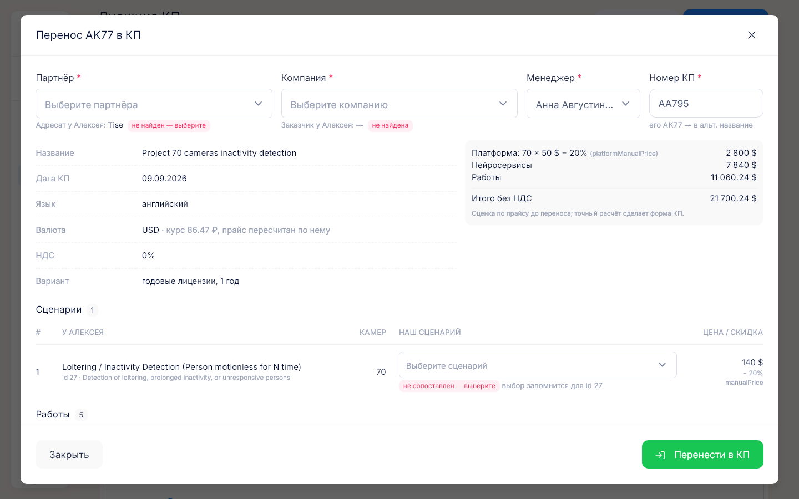

# Внешние КП

**Где найти:** «Работа» → «Внешние КП» (`/external-proposals`).
Здесь КП, которые менеджеры делают во внешнем генераторе OSMOVIEW CP. Портал забирает их сам,
а нужные переносятся в [КП портала](03-proposals.md) без ручного перебивания позиций.

## Забрать новые КП из генератора

«Действия» → «Обновить из API».

Детали новых записей подгружаются партиями, поэтому у части строк может остаться «детальные данные
не загружены» — нажмите «Загрузить» в строке или обновите список ещё раз.

Плашка «API не настроен» означает, что подключение к генератору не задано и обновление не сработает —
обратитесь к администратору. Если генератор недоступен, портал сообщит об ошибке и покажет уже
загруженные записи.

## Перенести внешнее КП в портал

1. «Перенести» в строке. У строки без деталей сначала нажмите «Загрузить».
2. Проверьте партнёра, компанию и менеджера. Под полями написано, как портал нашёл соответствие;
   «похожее название — проверьте» и красное «не найден — выберите» требуют ручного выбора.
3. В таблице сценариев проверьте «Наш сценарий» у позиций без соответствия или с пометкой «похожее
   название — проверьте». Выбор запоминается и в следующий раз подставится сам.
4. Прочитайте жёлтые предупреждения вверху окна и нажмите «Перенести в КП».

Откроется карточка нового КП — это обычное КП со значком облака у названия. Номер КП присваивается
наш, номер генератора уходит в альтернативное название. Суммы в окне переноса — оценка по прайсу,
точный расчёт сделает КП после переноса.

## Понять, перенесено ли КП

Перенесённая строка зелёная, в колонке «Перенос» — номер нашего КП и дата, при наведении — кто
перенёс. Только неперенесённые — «Фильтр» → «Перенесено» → «нет».

«КП не найдено» в колонке «Перенос» — наше КП, в которое переносили, удалено.

## Перенести ещё раз

«Дублировать» в строке перенесённого КП или «Перенести ещё раз как новое КП» в окне переноса.
Создастся ещё одно КП, и запись будет ссылаться уже на него; первое КП останется.

## Посмотреть исходные данные КП

Щелчок по названию в списке или по значку облака у КП в нашем списке и карточке. В окне — данные
из генератора: ключевые поля, сценарии с найденными соответствиями, работы, тексты.

## Как это устроено: что переносится

- **Шапка:** название, дата, язык, валюта и курс, ставка НДС, партнёр, компания, менеджер; номер
  генератора — в альтернативное название.
- **Варианты генератора** (годовые или бессрочные лицензии) — столбцами одной редакции, основной
  вариант отмечен.
- **Позиции:** платформа (камеры, цена, скидка); сценарии (количество, цена, скидка, комментарий,
  альтернативное название, пометка о дообучении); работы (часы × ставка и группа; работы с
  фиксированной ценой — как «1 × цена»); скидка партнёра на платформу и нейросервисы. Собственные
  сценарии генератора, которых нет у нас, переносятся в служебный сценарий.
- **Дополнительные сборы** — в «Дополнительные начисления» каждого варианта; требования к серверу
  и типы камер — в «Вычислительные ресурсы и оборудование»; исходный запрос, описание, цели, условия
  оплаты и сроки — в «Задачи».
- **Скидка клиента не переносится** — окно переноса предупредит об этом.
- **Фильтр по валюте и типу лицензий** работает только для записей с загруженными деталями.

## Частые вопросы

- **Откуда берутся внешние КП?** — Из генератора OSMOVIEW CP: «Действия» → «Обновить из API».
- **Почему у записи нет валюты и типа лицензий?** — Не загружены детали: «Загрузить» в строке.
- **Как понять, перенесено ли КП?** — Строка зелёная, в колонке «Перенос» номер нашего КП.
- **Сценарий не сопоставился.** — Выберите «Наш сценарий» в окне переноса; выбор запомнится.
- **Можно перенести одно КП дважды?** — Да, «Дублировать»: получится новое КП.
- **Где наше КП после переноса?** — Щелчок по номеру в колонке «Перенос» или «Работа» → «КП»,
  значок облака у названия.
- **Сколько записей ещё не перенесено?** — «Фильтр» → «Перенесено» → «нет» или виджет «Внешние КП»
  на рабочем столе.
