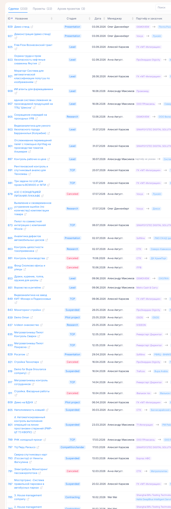
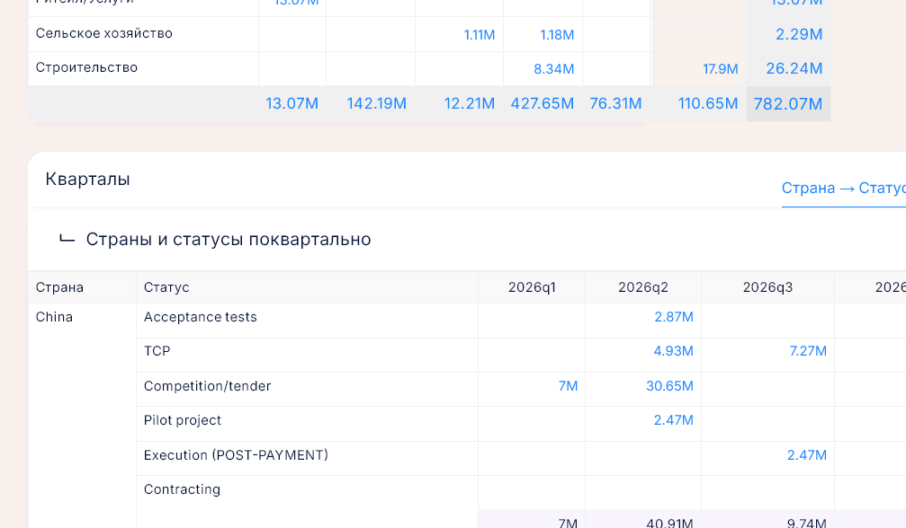

# Сделки Битрикс24 и воронка продаж

**Где найти:** «Работа» → «Реестр сделок Битрикс24» (`/bitrix/deal`) и «Работа» → «Воронка продаж»
(`/bitrix/dashboard`).
В портале хранится копия сделок из CRM Битрикс24. Здесь к сделкам привязывают КП, заводят по ним
проекты, выгружают сделки в Excel и смотрят сводку воронки. Сами сделки меняют только в Битрикс24.

## Найти сделки без КП

«Реестр сделок Битрикс24» → вкладка «Сделки». Это рабочий список: сделки с 2025 года, к которым
ещё не привязано КП. Как только КП привязано, сделка уходит с вкладки.

Сузить список — «Фильтр» (стадия, менеджер, страна, заказчик) или «Поиск» по названию, партнёру,
заказчику и ID с нажатием Enter. Нужна сделка, у которой КП уже есть, — в «Фильтре» поставьте
«Привязано КП» → «не важно». Сделок, созданных раньше 2025 года, в реестре нет.

## Привязать КП к сделке

1. В строке сделки нажмите значок в колонке «КП».
2. Выберите КП и нажмите «Привязать». Сначала предлагаются только КП партнёра сделки; нужного нет —
   отметьте «показать КП всех партнёров» или уточните поиск.

Сделка получит зелёную плашку с номером КП и уйдёт с вкладки «Сделки»; эта связь видна и в карточке КП.

Сменить КП: в том же окне «Отвязать», затем привяжите другое. КП с пометкой «занято» уже привязано
к другой сделке — сначала отвяжите его там.

## Завести проект по сделке

«+ проект» в колонке «Проект» строки сделки. Как заполнить и что будет дальше —
[06-deal-projects.md](06-deal-projects.md).

## Выгрузить сделки в Excel

1. Настройте вкладку, фильтр и поиск — в файл попадут ровно эти сделки.
2. «Действия» → «Выгрузить в Excel» → отметьте колонки → «Выгрузить». Если не отметить ни одной,
   выгрузятся все.

Кроме полей сделки, в файле есть «Итог стадии» («В работе», «Успех», «Провал») и номер, название
и статус привязанного КП.

## Посмотреть воронку продаж

«Работа» → «Воронка продаж» — сводка сделок в работе: суммы по лицензиям, услугам и разработке,
разрезы по отраслям и менеджерам, по плановым кварталам («Кварталы») и месяцам («6 месяцев»).

- **В другой валюте:** кнопка с валютой в шапке → выберите валюту → «Сохранить». Все суммы
  пересчитаются по курсу на сегодня.
- **По стадии, менеджеру, вероятности или стране:** «Фильтр». Он запоминается за вами до «Убрать».
- **Выгрузить таблицу:** значки PDF и Excel в заголовке таблицы; в файле учтены фильтр и валюта.

Какие сделки попадают в воронку — в «Как это устроено».

## Открыть сделки за цифрой

Клик по сумме в карточках показателей или по любой ячейке, подытогу и итогу таблиц открывает сделки,
из которых сложена цифра, со ссылками в Битрикс24. Строки в другой валюте подсвечены жёлтым.

## Разобрать проблемные сделки

Красная кнопка с треугольником и числом в шапке «Воронки продаж» появляется, когда у сделок в работе
в Битрикс24 не заполнены или не сходятся поля. Клик покажет сделки и что с каждой не так. Исправлять
нужно в Битрикс24; после синхронизации число обновится.

| Проблема | Когда срабатывает |
|---|---|
| «Месяц и квартал не совпадают» | плановый месяц не входит в плановый квартал |
| «Не указан конечный заказчик» | пусто поле заказчика; на стадии Lead не проверяется |
| «Не указан партнёр» | у сделки нет компании Битрикс24 |
| «Не заполнен месяц сделки или квартал» | нет планового месяца или квартала; на Lead, Research, Presentation не проверяется |
| «Не указана стоимость лиценцзий и(или) услуг» | сумма сделки есть, а стоимости лицензий и услуг нет; на Lead, Research, Presentation не проверяется |
| «Не указана стоимость сделки» | сумма нулевая; на Lead, Research, Presentation, Pilot project, Competition/tender не проверяется |
| «Стоимость лицензий и услуг не совпадает с общей стоимостью» | только рублёвые сделки: лицензии + услуги ≠ сумма сделки |
| «Стоимость лицензий и услуг имеет кривые символы [НЕ РУБ!]» | валютные сделки: в стоимости лицензий или услуг пробелы или буквы |

## Обновить данные из Битрикс24

Реестр и воронка показывают копию, которая обновляется синхронизацией: «Настройки» → «Синхронизация
Битрикс24» → «Синхронизировать» у нужного набора данных. Раздел «Настройки» есть не у всех — если
его нет, попросите коллегу, у которого он есть. Дату последней синхронизации показывает виджет
«Синхронизация Битрикс24» на рабочем столе.

## Как это устроено

- **Портал сделки только читает.** Стадию, сумму, менеджера и заказчика меняют в Битрикс24. Из
  сделки берутся ID, название, стадия, дата создания, менеджер, партнёр (компания Битрикс24),
  конечный заказчик, страна получения средств, сумма и валюта, вероятность, плановые квартал
  и месяц, стоимость лицензий, услуг и разработки, источник, направление, комментарий.
- **Партнёр сделки** — это компания сделки в Битрикс24, сопоставленная с партнёром портала
  ([07-partners.md](07-partners.md)).
- **Стадии и их группы:**

  | Стадия | Группа |
  |---|---|
  | Lead, Research, Presentation, Pilot project, Competition/tender, TCP, Contracting, Invoice + Specification, Execution (PRE-PAYMENT), Execution (POST-PAYMENT), Acceptance tests, Closing documents, Suspended | в работе (Suspended — приостановлена, но не закрыта) |
  | Completed | выиграна |
  | Canceled | проиграна |

  Цвет плашки стадии: синий — в работе, зелёный — выиграна, красный — проиграна.
- **Вкладки реестра:** «Сделки» — с 2025 года без КП, «Проекты» — с действующим проектом, «Архив
  проектов» — с проектом в архиве. Число в скобках — сколько сделок на вкладке. Вкладка и отбор
  хранятся в адресе страницы; при смене вкладки фильтр сбрасывается.
- **В реестре одна сделка — одно КП:** у сделки с привязанным КП «Привязать» не предлагается, а КП,
  у которого уже есть сделка, помечено «занято». В карточке КП можно привязать к одному КП несколько
  сделок и назначить главную — [03-proposals.md](03-proposals.md).
- **Суммы в реестре** — в валюте сделки; суммы не в рублях выделены зелёным.
- **В воронку** входят только сделки с ненулевой суммой на стадиях Lead, Research, Presentation,
  Pilot project, Competition/tender, TCP, Contracting, Invoice + Specification, Execution
  (POST-PAYMENT) и Acceptance tests. Execution (PRE-PAYMENT), Closing documents, Suspended,
  Completed и Canceled в неё не входят.
- **«Кварталы» и «6 месяцев»** строятся по плановым кварталу и месяцу из Битрикс24: четыре квартала
  текущего года и шесть месяцев начиная с текущего. В месячную таблицу сделка попадает, только если
  её плановые месяц и квартал согласованы.
- **Карточка «Продление лицензий»** на воронке — ключи к продлению и их оценка,
  [10-licenses.md](10-licenses.md).
- **Где сумма или статус КП расходятся со сделкой** — отчёт «Расхождения с Битрикс24»,
  [11-reports.md](11-reports.md).

## Частые вопросы

- **Почему в реестре нет моей сделки?** — На вкладке «Сделки» только сделки с 2025 года без КП.
  Поставьте «Привязано КП» → «не важно» или найдите сделку по ID; сделок старше 2025 года в реестре нет.
- **Данные сделки устарели.** — Реестр — копия Битрикс24, нужна синхронизация: «Настройки» →
  «Синхронизация Битрикс24».
- **Можно поправить стадию или сумму в портале?** — Нет, только в Битрикс24.
- **Как открыть сделку в Битрикс24?** — Клик по ID или названию сделки.
- **Не получается привязать КП.** — К сделке уже привязано КП (сначала «Отвязать») или у КП уже
  есть другая сделка — пометка «занято».
- **Где сделки одного партнёра?** — На карточке партнёра, вкладка «Сделки Битрикс24».
- **Что за красная кнопка с числом на «Воронке продаж»?** — Столько сделок с незаполненными или
  несогласованными полями; клик покажет, что не так.
- **Почему суммы воронки не сходятся с реестром?** — Воронка считает только сделки в работе с суммой
  и пересчитывает их в выбранную валюту; реестр показывает сделки в их валюте.
- **Где сравнить КП со сделкой?** — «Отчёты» → «Расхождения с Битрикс24».
