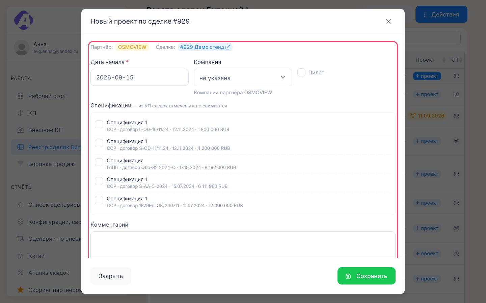
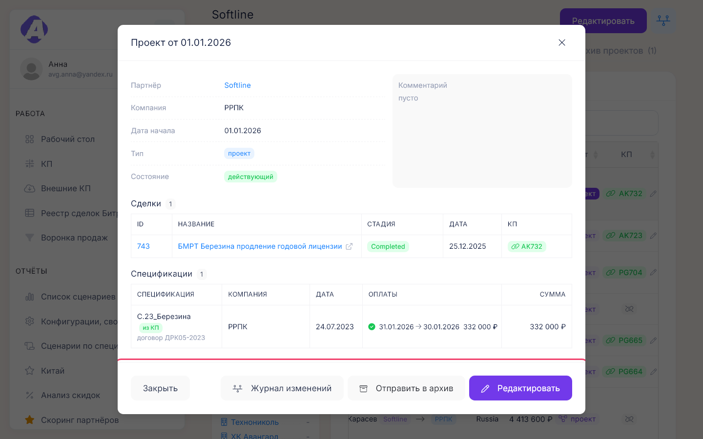
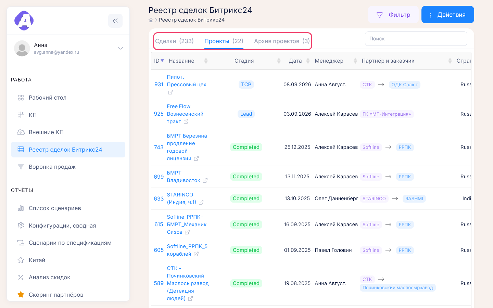
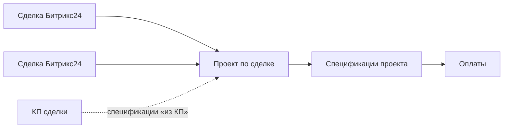

# Проекты по сделкам

**Где найти:** своей страницы у проектов нет. Они видны в «Работа» → «Реестр сделок Битрикс24»
(колонка «Проект», вкладки «Проекты» и «Архив проектов»), на карточке партнёра (те же вкладки)
и в виджете «Проекты по сделкам» на рабочем столе. Проект открывается окном поверх страницы.
[Проект по сделке](00-glossary.md) фиксирует, что по выигранной сделке идёт работа: у какого
партнёра и заказчика, с какой даты, пилот ли это, какие сделки и спецификации к нему относятся.
Проекты учитываются в [скоринге партнёров](11-reports.md).

## Завести проект по сделке

1. «Реестр сделок Битрикс24» или вкладка «Сделки Битрикс24» на карточке партнёра → «+ проект»
   в строке сделки.
2. Укажите дату начала и заказчика. Для пилота отметьте «Пилот» и срок окончания.
3. Отметьте спецификации, которые относятся к проекту. Спецификации из КП сделки уже отмечены.

Сделка переедет на вкладку «Проекты», а вместо кнопки в строке появится значок проекта.

Не видите сделку — на вкладке «Сделки» реестра по умолчанию только сделки без КП: в «Фильтре»
поставьте «Привязано КП» → «не важно».

Окно пишет «Партнёр сделки не определён» — компания сделки в Битрикс24 не сопоставлена ни с одним
партнёром. Выберите партнёра в этом же окне и нажмите «Сопоставить и продолжить»: компания
закрепится за партнёром, и откроется форма проекта. Если выбрать партнёра не предлагается, у сделки
в Битрикс24 не указана компания — заполните её там и дождитесь синхронизации.

## Объединить несколько сделок в один проект

У следующей сделки нажмите «+ проект» → «Прикрепить к существующему» → выберите проект →
«Прикрепить».

Предлагаются только действующие проекты того же партнёра и того же заказчика; если таких нет,
переключателя в окне не будет. Сделка может входить только в один проект.

## Открепить сделку от проекта

На карточке проекта такой кнопки нет. Откройте адрес `/deal-projects/box/form/<ID сделки>`
(ID — первая колонка реестра) → «Открепить сделку» → подтвердите.

Проект остаётся, даже если сделок в нём не осталось.

## Изменить проект

Значок проекта в строке сделки (или строка виджета, вкладка «Проекты» партнёра) → «Редактировать».

- Сменили заказчика — спецификации других компаний снимутся, спецификации из КП сделок останутся.
- Сняли «Пилот» — срок окончания сотрётся.

## Посмотреть оплаты по проекту

Откройте проект: в разделе «Спецификации» — график платежей каждой спецификации с просрочкой
в днях. Сумма спецификации считается по плановым платежам. Сами оплаты вносятся на карточке
партнёра — [09-contracts-payments.md](09-contracts-payments.md).

## Отправить проект в архив или вернуть

Проект → «Отправить в архив». Его сделки переедут на вкладку «Архив проектов», значок станет
серым. Вернуть — «Вернуть из архива» в том же окне.

Удалить проект нельзя. Если проект завели по ошибке, открепите сделки и отправьте его в архив.

## Найти проекты

- Все действующие или архивные — вкладки «Проекты» и «Архив проектов» реестра сделок.
- Проекты одного партнёра — те же вкладки на его карточке.
- Сводка на рабочем столе — виджет «Проекты по сделкам». В режиме «Ждут сопоставления партнёра»
  он показывает сделки в проектных стадиях, по которым проект не завести: их компания Битрикс24
  не сопоставлена с партнёром.

## Узнать, кто менял проект

Проект → «Журнал изменений» (нужно право на журнал). В журнале — дата начала, заказчик, пилот
и срок, комментарий, архив, прикрепление и открепление сделок, спецификации. Посмотреть проект
на прошлую дату нельзя. См. [14-entity-log.md](14-entity-log.md).

## Как это устроено

- **Проект объединяет сделки одного партнёра и одного заказчика.** Партнёр берётся из компании
  сделки в Битрикс24 (сопоставление — в форме партнёра, [07-partners.md](07-partners.md)) и в
  проекте не выбирается. Заказчик может быть не указан.
- **Названия у проекта нет** — он подписан «Проект от <дата начала>», у пилота с пометкой «пилот».
- **Срок окончания бывает только у пилота.**
- **Спецификации из КП** привязанных сделок попадают в проект сами и не снимаются. Остальные
  отмечают вручную — только спецификации партнёра и заказчика проекта.
- **Архив — не удаление.** Архивный проект остаётся в скоринге и статистике партнёра, его сделки —
  в реестре и на вкладке «Сделки Битрикс24» партнёра.
- **Цвет значка проекта:** синий — проект, жёлтый с датой — пилот, серый — в архиве.
- **Проект компании — другое понятие:** это папка конфигураций для спецификаций на карточке
  компании ([08-companies.md](08-companies.md)).

## Частые вопросы

- **Где список всех проектов?** — «Реестр сделок Битрикс24», вкладка «Проекты»; архивные —
  «Архив проектов».
- **Окно проекта пишет «Партнёр сделки не определён».** — Компания сделки не сопоставлена
  с партнёром: выберите партнёра в этом окне и нажмите «Сопоставить и продолжить».
- **Можно объединить несколько сделок в один проект?** — Да, если у них один партнёр и один
  заказчик: «+ проект» → «Прикрепить к существующему».
- **Почему нет поля «Срок»?** — Срок бывает только у пилота; отметьте «Пилот».
- **Почему не снимается спецификация?** — Она пришла из КП сделки проекта, такие не снимаются.
- **Сделка пропала после архивации проекта?** — Нет: она на вкладке «Архив проектов»
  и по-прежнему в «Сделках Битрикс24» на карточке партнёра.
- **Как удалить проект?** — Никак: открепите сделки и отправьте проект в архив.
- **Чем проект по сделке отличается от проекта компании?** — Проект по сделке — работа по сделке
  Битрикс24, проект компании — папка конфигураций для спецификаций ([08-companies.md](08-companies.md)).
- **Где оплаты по проекту?** — В окне проекта, раздел «Спецификации».
