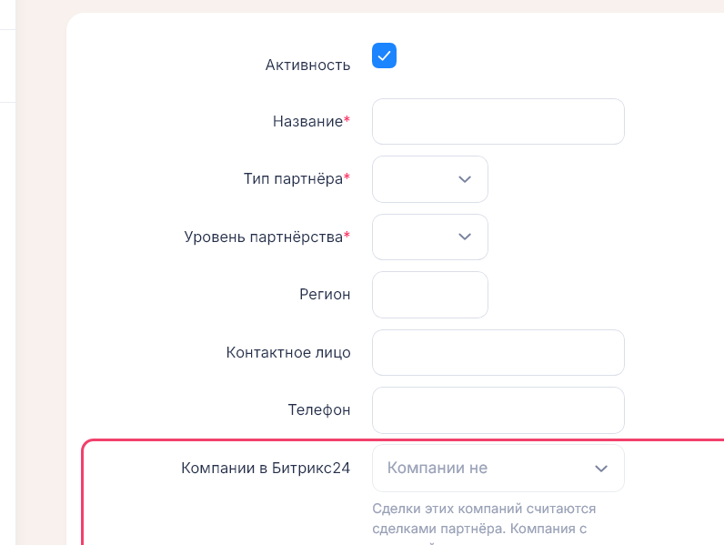
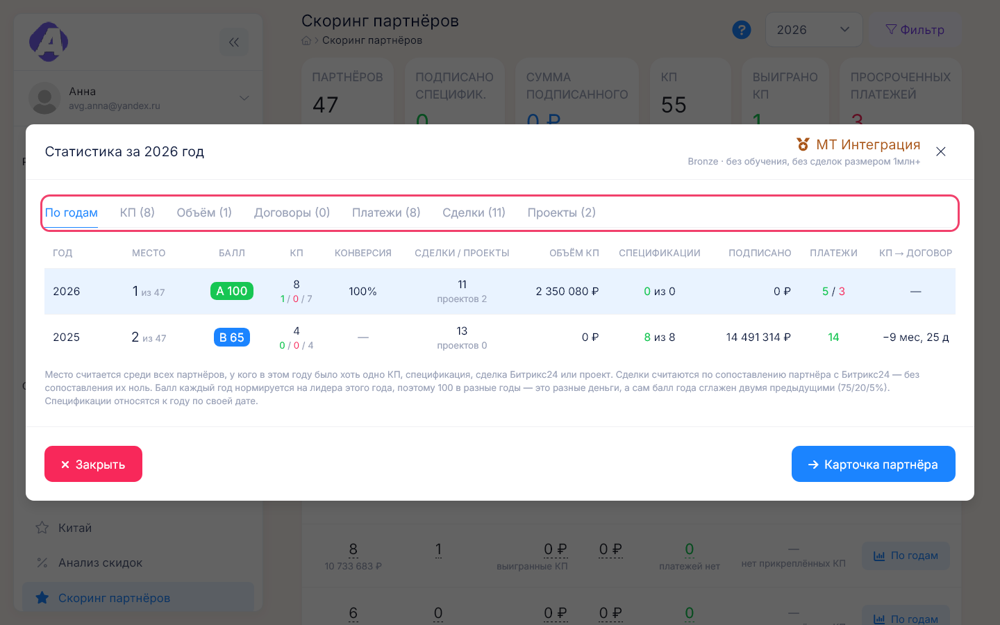

# Партнёры

**Где найти:** меню «Справочники» → «Партнёры» (`/partners`).
[Партнёр](00-glossary.md) — контрагент, через которого идут продажи: с ним заключаются договоры,
ему выставляются КП, за ним закреплены компании-заказчики и компании Битрикс24. Здесь заводят
партнёров, связывают их с Битрикс24 и смотрят всё, что по партнёру происходит.

## Завести партнёра

1. «Справочники» → «Партнёры» → «Добавить».
2. Заполните название, тип и уровень партнёрства.
3. Сразу выберите «Компании в Битрикс24» — компании этого партнёра в CRM (подробнее — следующая
   задача). Без них у партнёра не будет сделок, проектов и части баллов скоринга.

После сохранения откроется карточка партнёра. Компании-заказчики к партнёру прикрепляются
не здесь, а в форме самой компании — см. [08-companies.md](08-companies.md).

## Сопоставить партнёра с компанией Битрикс24

Нужно, когда на карточке партнёра написано «Партнёр не сопоставлен с Битрикс24», у партнёра
пустые вкладки сделок или в скоринге ноль сделок.

1. Карточка партнёра → «Редактировать».
2. В «Компании в Битрикс24» добавьте все компании CRM, через которые работает партнёр.
3. Сохраните.

Сделки этих компаний сразу становятся сделками партнёра: появляются на его вкладках, в реестре
сделок и в скоринге. Чтобы снять привязку, удалите компанию из поля.

Компания с пометкой «занята: <партнёр>» уже закреплена за другим партнёром — сначала уберите её
там. Если в блоке «Битрикс24» карточки компания показана как «компания #номер» с пометкой «нет
в зеркале Битрикс24», её удалили или переименовали в CRM — выберите актуальную.

## Посмотреть сделки и проекты партнёра

Карточка партнёра → вкладки «Сделки Битрикс24», «Проекты», «Архив проектов». Это тот же
[реестр сделок](05-bitrix-deals.md), только по компаниям партнёра, с теми же фильтром, поиском
и кнопками привязки КП и создания проекта.

Отличия от общего реестра:

- на вкладке «Сделки Битрикс24» показаны **все** сделки партнёра — и с КП, и без;
- вкладка и фильтр сохраняются в адресе страницы: ссылкой можно отправить коллеге готовую выборку;
- число в скобках у вкладки — сколько сделок в ней без вашего фильтра.

Сделка с архивным проектом остаётся на вкладке «Сделки Битрикс24»: в архив уходит проект, а не
сделка. Как заводить проекты — [06-deal-projects.md](06-deal-projects.md).

## Посмотреть договоры, спецификации и оплаты партнёра

Карточка партнёра → вкладка «Договоры»: договоры, спецификации по компаниям и график платежей
с отметками просрочки. Как их заводить и вести оплаты — [09-contracts-payments.md](09-contracts-payments.md).

## Узнать показатели партнёра по годам

Показатели партнёра — место в рейтинге, балл, КП и конверсия, объём, договоры, платежи, сделки,
проекты — открываются не с карточки, а из отчёта: «Отчёты» → «Скоринг партнёров» → «По годам»
или любая цифра в строке партнёра.

Как считается балл — [11-reports.md](11-reports.md).

## Узнать, кто менял партнёра

Карточка партнёра → «Журнал изменений» (нужно право на журнал). В ленте партнёра — не только его
поля, но и договоры, спецификации, оплаты, ключи и сопоставление с Битрикс24. См.
[14-entity-log.md](14-entity-log.md).

## Как это устроено

- **Сделки партнёра — это сделки его компаний Битрикс24.** Одна компания Битрикс24 закреплена
  только за одним партнёром, у партнёра их может быть несколько.
- **Тип и уровень — разные признаки.** Тип — роль партнёра: Agent, Dealer, Distributor, Vendor.
  Уровень — статус партнёрства с медалью: Agent, Vendor, Bronze, Silver, Gold, Platinum; критерий
  уровня — в подсказке у медали в списке. На карточке уровень показан в строке «Тип партнёра».
- **Цифры на карточке:** у компании-заказчика — число её спецификаций, у компании Битрикс24 — число
  её сделок начиная с указанного под списком года.
- **Неактивный партнёр** не удаляется и остаётся в списке серой строкой.

## Частые вопросы

- **Почему у партнёра нет сделок и в скоринге «нет сопоставления»?** — Не заполнены «Компании
  в Битрикс24». См. «Сопоставить партнёра с компанией Битрикс24».
- **Не могу выбрать компанию Битрикс24 — она «занята».** — Она закреплена за другим партнёром;
  уберите её в форме того партнёра.
- **Где сделки конкретного партнёра?** — Карточка партнёра → «Сделки Битрикс24».
- **Как прикрепить компанию-заказчика к партнёру?** — В форме компании, поле «Партнёр»; с карточки
  партнёра этого сделать нельзя.
- **Где статистика партнёра по годам?** — «Отчёты» → «Скоринг партнёров» → «По годам» в строке
  партнёра.
- **Почему сделка с архивным проектом всё ещё в «Сделках Битрикс24»?** — В архив уходит проект,
  сделка остаётся.
- **Как удалить партнёра?** — В списке партнёров «⋮» → «Удалить». Если партнёр больше не работает,
  но история нужна, снимите «Активность» вместо удаления.
- **Кто изменил данные партнёра?** — «Журнал изменений» на карточке, [14-entity-log.md](14-entity-log.md).
