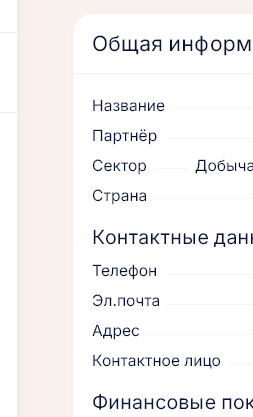
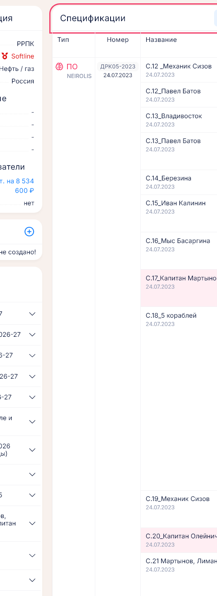

# Компании

**Где найти:** меню «Справочники» → «Компании» (`/companies`).
[Компания](00-glossary.md) — конечный заказчик. Она закреплена за партнёром, и на её карточке
собрано всё по заказчику: КП, спецификации, оплаты, лицензионные ключи и проекты с конфигурациями.

## Завести компанию-заказчика

1. «Справочники» → «Компании» → «Добавить».
2. Укажите название, сектор, страну и **партнёра**, через которого идёт работа с заказчиком.

Партнёра компании назначают только здесь: с карточки партнёра компанию прикрепить нельзя.
Спецификацию по договору можно завести только для компании этого партнёра, поэтому заказчика
создают до спецификации.

## Сменить партнёра у компании

Карточка компании → «Редактировать» → «Партнёр» → «Сохранить».

Спецификации компании остаются в договорах прежнего партнёра. После смены проверьте вкладку
«Договоры» у обоих партнёров и при необходимости перенесите спецификации — см.
[09-contracts-payments.md](09-contracts-payments.md).

## Найти всё по заказчику

На карточке компании собраны:

- **КП** заказчика; «+» в этом блоке создаёт КП, в котором компания уже выбрана;
- **спецификации** по договорам партнёра — с ключами, конфигурациями, КП и суммой оплат;
  блок появляется, когда есть хотя бы одна спецификация;
- **оплаты**: ссылки «N шт. на … ₽» у «Оплаты (полученные)» и «Оплаты (будущие)» открывают список
  платежей (только просмотр), кнопка «Платёжный календарь» над спецификациями — календарь
  с отбором по этой компании;
- **лицензионные ключи** со сроками действия.

## Разобраться с расхождением суммы

Бейдж «N с расхождением» над спецификациями и плашка «Расхождение» в строке значат, что сумма
спецификации не сходится с графиком платежей или с суммой прикреплённого КП.

1. Нажмите плашку «Расхождение» в колонке «Сумма оплат» — появятся причины и суммы.
2. Исправьте источник: график в «Управлении оплатами» спецификации или прикреплённое КП — см.
   [09-contracts-payments.md](09-contracts-payments.md).

## Завести проект компании и конфигурацию

Конфигурация описывает, что поставлено заказчику: тип платформы, срок лицензии, число потоков.
Её прикрепляют к спецификации, и она попадает в отчёт «Конфигурации, сводная».

1. Карточка компании → блок «Проекты» → «+». Введите название — префикс номера присвоится сам.
2. В строке проекта → «спец.»: выберите тип платформы, срок в месяцах (0 — бессрочно), число
   потоков. Комментарий обязателен, если у проекта уже есть конфигурации: по нему их различают.
   Номер конфигурации соберётся автоматически.
3. В таблице спецификаций, колонка «Конфиг.» → «Прикрепить» → выберите конфигурацию.

## Выдать ключ заказчику

Карточка компании → «+» в блоке «Лицензионные ключи» или в колонке «Ключи» нужной спецификации.
Сроки и продление — [10-licenses.md](10-licenses.md).

## Как это устроено

- **Проект компании — не проект по сделке.** Проект компании — папка с номером для конфигураций
  спецификаций. Проект по сделке — внедрение по выигранной сделке Битрикс24, он заводится из реестра
  сделок: [06-deal-projects.md](06-deal-projects.md).
- **Спецификации создаются у партнёра** (вкладка «Договоры»), а на карточке компании видны все
  спецификации этого заказчика по договорам его партнёра.
- **Цвета:** срок ключа красный — истёк, оранжевый — истекает в ближайшие три месяца; серый ключ —
  неактивен. Строка спецификации красная — спецификация отменена.
- **Контактные данные** на карточке пока всегда пустые: в форме компании этих полей нет.

## Частые вопросы

- **Чем проект компании отличается от проекта по сделке?** — Проект компании хранит конфигурации
  для спецификаций, проект по сделке — внедрение по сделке Битрикс24 ([06-deal-projects.md](06-deal-projects.md)).
- **Почему на карточке нет блока «Спецификации»?** — У компании ещё нет спецификаций. Они
  заводятся на карточке партнёра, вкладка «Договоры».
- **Не могу выбрать компанию в спецификации.** — Компания закреплена за другим партнёром: в
  спецификацию попадают только компании партнёра, у которого договор.
- **Что значит «Расхождение»?** — Сумма спецификации не совпадает с графиком платежей или с КП;
  нажмите плашку, чтобы увидеть причину.
- **Где будущие платежи заказчика?** — Карточка компании → «Оплаты (будущие)» или «Платёжный
  календарь» над спецификациями.
- **Почему ключ красный или оранжевый?** — Красный — истёк, оранжевый — истекает в ближайшие
  три месяца.
- **Где заметки по переговорам с компанией?** — В виджете «Заметки по компаниям» на рабочем
  столе ([02-desktop.md](02-desktop.md)); на карточке компании их нет.
- **Как удалить компанию?** — В списке компаний «⋮» → «Удалить».
