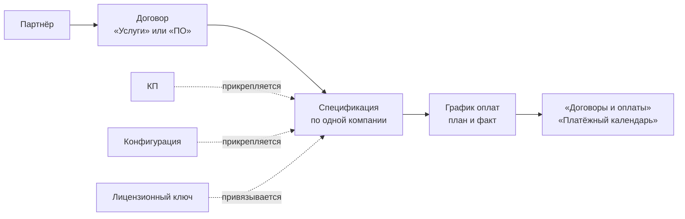
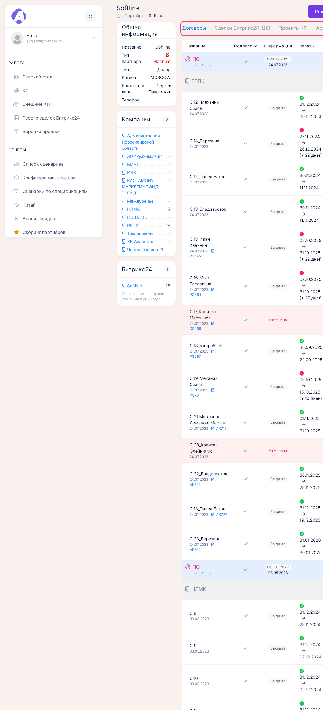
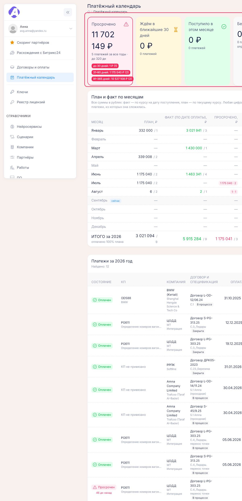
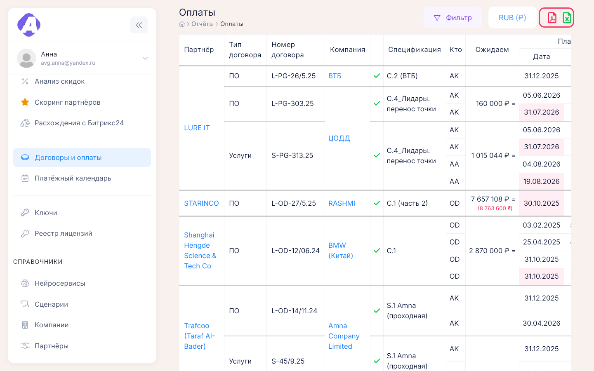

# Договоры, спецификации и оплаты

**Где найти:** договоры и спецификации — карточка партнёра, вкладка «Договоры»; отчёт — «Отчёты» →
«Договоры и оплаты» (`/report/payments`); план поступлений — «Отчёты» → «Платёжный календарь»
(`/payment-calendar`).
Здесь ведут цепочку от договора с партнёром до денег: заводят [спецификации](00-glossary.md),
составляют график оплат, отмечают поступления и следят за просрочкой.
«Платёжный календарь» доступен только с правом на него; без права пункта нет в меню.

## Завести договор с партнёром

Карточка партнёра → «Договоры» → зелёный «+» в шапке таблицы. Укажите организацию-исполнителя,
тип («Услуги» или «ПО»), номер и дату.

Удалить договор можно, только пока в нём нет спецификаций.

## Добавить спецификацию

1. Если заказчика ещё нет в портале, заведите компанию и укажите в ней этого партнёра —
   [08-companies.md](08-companies.md). В спецификации можно выбрать только компании партнёра.
2. Карточка партнёра → «Договоры» → «+» в строке договора.
3. Выберите компанию, введите название, валюту и сценарии поставки.

Дату можно не заполнять — встанет дата договора. От даты спецификации считаются срок сделки
в КП и год в отчётах, поэтому ставьте фактическую.

Сумму не вводят: она появится, когда вы составите график оплат. Спецификацию можно перенести
в другой договор того же типа у этого партнёра — в её редактировании.

## Составить график оплат и отметить поступление

1. В строке спецификации нажмите значок монет «Управление оплатами».
2. Добавьте плановые платежи: дата и сумма, ответственный менеджер. Не знаете срок — отметьте «?»:
   платёж попадёт в «Без даты».
3. Когда деньги пришли, впишите в той же строке фактическую дату и сумму.

Сохранить не получится, пока у каждой строки не выбран менеджер и нет ни плановой, ни фактической
суммы, а также если введена фактическая сумма без даты факта.

После сохранения сумма спецификации пересчитается, а просрочка, календарь и отчёты обновятся.

## Прикрепить КП к спецификации

Связь нужна, чтобы видеть путь «КП → сделка → договор → оплаты» в сводной информации по сделке
и считать скоринг партнёра.

- С карточки партнёра: значок цепочки «Прикрепление КП» в строке спецификации → «Прикрепить»
  у нужного КП.
- С карточки компании: колонка «КП» в таблице спецификаций → «Прикрепить».
- Из КП: значок «Прикрепить спецификацию по …» в заголовке блока ПО или услуг. Так одно КП
  прикрепляют к разным спецификациям — отдельно по ПО и по услугам.

В списке показаны КП этой компании. Пометка «Уже прикреплено: …» означает, что КП привязано
к другой спецификации.

КП в работе при прикреплении автоматически становится «Выиграно». Проигранное КП не меняется —
его статус правят вручную в карточке КП.

## Прикрепить конфигурацию к спецификации

Карточка компании → таблица спецификаций → колонка «Конфиг.» → «Прикрепить». Конфигурации
заводятся в проектах компании ([08-companies.md](08-companies.md)); прикреплённые попадают
в отчёт «Конфигурации, сводная».

## Найти просроченные платежи

«Отчёты» → «Платёжный календарь» → показатель «Просрочено». Там сумма, число платежей, самая
долгая просрочка и разбивка по срокам: до 30 дней, 31–90, 91–365, больше года. Каждая цифра
открывает список этих платежей с партнёром, компанией и спецификацией.

Просрочку по одному партнёру видно и на его вкладке «Договоры» — по значкам у платежей
(см. «Как это устроено»).

## Посмотреть план поступлений на месяц

«Платёжный календарь» → выберите год → в «План и факт по месяцам» нажмите сумму месяца. Откроется
список платежей месяца с состоянием каждого.

Суммы в календаре в рублях: факт — по курсу на дату поступления, план — по текущему курсу. Если
курса на нужную дату нет, календарь предупредит и посчитает валюту один к одному.

## Выгрузить оплаты в Excel или PDF

«Отчёты» → «Договоры и оплаты» → при необходимости «Фильтр» и валюта отчёта → значок Excel или PDF.
В файл попадают только строки, прошедшие фильтр; суммы — в выбранной валюте.

Частые фильтры: «Только неоплаченные», «Просрочка оплаты», «Оплата не совпадает», период по дате
плана или факта. Завершённые сделки в отчёт по умолчанию не входят — включите «Отображать
завершенные сделки».

## Как это устроено

- **Сумма спецификации = сумма плановых платежей** её графика.
- **Просрочка** — плановая дата прошла, а факта нет; дни считаются от плановой даты. Если деньги
  пришли позже плана, платёж остаётся «Оплачено с просрочкой» с «(+ N дней)».
- **Факт не совпал с планом** — в строке показано «план → факт», а на карточке компании появляется
  «Расхождение».
- **Значки платежей** на вкладке «Договоры»: серые песочные часы — ждём платёж; зелёная галочка —
  оплачено; оранжевые песочные часы — просрочен; красный восклицательный знак — оплачено с просрочкой.
- **В отчёте «Договоры и оплаты»** красная плановая дата — просрочка, жёлтая «(неизвестно)» — срок
  не определён; итоги считаются отдельно по каждой организации-исполнителю.
- **Календарь по умолчанию** показывает спецификации «В процессе» и уже оплаченные платежи по любым
  спецификациям. Просрочку прошлых лет и платежи без дат видно в режиме «за все годы» фильтра.
  Отбор календаря сохраняется в адресе страницы.
- **Отменённая спецификация** в календаре выносится в «Спец. отменена» и в план не входит.

## Частые вопросы

- **Почему у спецификации нулевая сумма?** — Не заполнен график оплат: «Управление оплатами»
  в строке спецификации.
- **Как отметить, что деньги пришли?** — «Управление оплатами» → в строке платежа фактическая
  дата и сумма → «Сохранить».
- **Где все просроченные платежи?** — «Платёжный календарь» → «Просрочено».
- **Как связать КП с договором?** — КП прикрепляется не к договору, а к спецификации: значок
  цепочки в строке спецификации.
- **Почему КП стало «Выиграно»?** — Его прикрепили к спецификации; КП в работе меняет статус
  автоматически.
- **Где выгрузить оплаты в Excel?** — «Отчёты» → «Договоры и оплаты» → значок Excel; учитывается
  текущий фильтр.
- **Что значит «Без даты» в календаре?** — Платежи с отметкой «?» (срок неизвестен).
- **Почему в календаре нет платежей закрытой спецификации?** — По умолчанию показаны
  спецификации «В процессе»; выберите нужный «Статус спецификации» в фильтре.
- **Нет пункта «Платёжный календарь».** — Нужно право на календарь; обратитесь к администратору.
