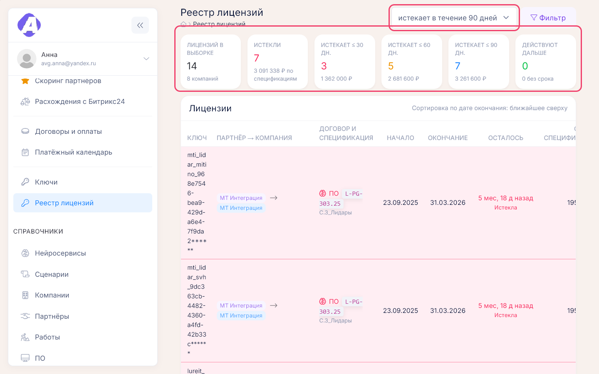

# Лицензионные ключи

**Где найти:** ключи выдают на карточке компании (блок «Лицензионные ключи»); сводно — «Отчёты» →
«Ключи» (`/report/license_keys`) и «Отчёты» → «Реестр лицензий» (`/analytics/licenses`).
[Лицензионный ключ](00-glossary.md) выдаётся заказчику на срок. Здесь выдают ключи, следят
за сроками и оценивают продления.

## Выдать ключ заказчику

1. Карточка компании → «+» в блоке «Лицензионные ключи» или в колонке «Ключи» нужной спецификации.
2. Введите ключ и срок действия.
3. Выберите спецификацию, по которой выдан ключ.

Без спецификации у ключа не будет суммы продления в реестре, а в отчёте «Ключи» вместо номера
договора будет «…». Если у компании нет спецификаций, сначала заведите спецификацию —
[09-contracts-payments.md](09-contracts-payments.md).

## Узнать, какие лицензии скоро истекают

«Отчёты» → «Реестр лицензий» → выберите горизонт: истекает в течение 30, 60 или 90 дней, только
истекшие или все.

Лицензии идут по дате окончания, ближайшие сверху; красные строки — истёкшие и истекающие меньше
чем через 30 дней. Горизонт включает всё, что раньше: в «60 дней» попадут и истекающие через
10 дней, и уже истёкшие. Чтобы убрать истёкшие, в «Фильтре» включите «скрыть истёкшие».
Горизонт и фильтр сохраняются в адресе страницы — ссылку можно отправить коллеге.

Быстрее: виджет «Истекающие ключи» на рабочем столе или карточка «Продление лицензий» на
«Воронке продаж». В отчёте «Ключи» то же даёт фильтр «Заканчиваются в течении трёх месяцев».

## Оценить сумму продлений

- «Реестр лицензий» — суммы по истёкшим и истекающим за 30, 60 и 90 дней.
- «Работа» → «Воронка продаж» → карточка «Продление лицензий» → число: ключи на 30, 60 или
  90 дней и «Оценка продлений» за выбранный период. Истёкшие ключи остаются здесь ещё 30 дней.

Оценка — не счёт: отдельной цены продления в портале нет, берётся сумма спецификации, по которой
выдан ключ, в рублях. В окне «Продление лицензий» сумма спецификации делится на число её ключей.

## Отметить продление лицензии

Отдельного действия «продлить» нет. Выдайте компании новый ключ с новыми датами, а у старого
снимите «Активный». Виджет «Продления» считает продлением новый ключ у компании, у которой ключи
уже были.

## Выключить или удалить ключ

Карандаш у ключа на карточке компании → снимите «Активный». Ключ пропадёт из реестра и из отчёта
«Ключи», но сохранится: на карточке компании он спрятан под ссылкой «+ N неактивных ключей»,
в отчёте «Ключи» виден с фильтром «Показать неактивные».

«Удалить» в том же окне стирает ключ безвозвратно. Если ключ просто больше не действует, выключите его.

## Найти ключи компании, договора или партнёра

- Все ключи заказчика — на карточке компании.
- «Отчёты» → «Ключи» → «Фильтр»: компания, номер договора, даты начала и окончания. Отчёт
  сгруппирован по партнёрам, компаниям и договорам.
- «Реестр лицензий» → «Фильтр»: партнёр или поиск по ключу, компании, спецификации.

## Выгрузить ключи

У «Ключей» и «Реестра лицензий» выгрузки нет. Действующие ключи по компаниям с суммами выгружает
отчёт «Китай» — [11-reports.md](11-reports.md).

## Как это устроено

- **«Ключи» и «Реестр лицензий» показывают одни и те же ключи.** «Ключи» — полный список по
  партнёрам и компаниям с количеством и комментарием; «Реестр лицензий» — по срокам и деньгам,
  с итогами.
- **По умолчанию** оба отчёта показывают только активные ключи.
- **Цвета сроков:**
  - карточка компании: красный — истёк, оранжевый — истекает в ближайшие три месяца, серый — ключ
    выключен;
  - отчёт «Ключи»: розовый фон — активный ключ с истёкшим сроком, жёлтый — истекает в ближайшие
    три месяца, бледный красный текст — ключ выключен;
  - «Реестр лицензий»: «Истекла» и «Меньше месяца» — красные, «До двух месяцев» — жёлтый,
    «До трёх месяцев» — синий, «Действует» — зелёный, «Срок не указан» — серый.
- **Фильтр отчёта «Ключи»** запоминается на сутки.
- **История изменений ключей** — в журнале партнёра ([14-entity-log.md](14-entity-log.md)).
- **Виджеты рабочего стола** по ключам: «Истекающие ключи», «Реестр лицензий», «Продления»,
  «Ключи по компаниям», «Карточка ключа» — [02-desktop.md](02-desktop.md).

## Частые вопросы

- **Где ключи?** — На карточке компании; все сразу — «Отчёты» → «Ключи».
- **Где выдать новый ключ?** — Только на карточке компании: «+» в блоке «Лицензионные ключи».
- **Какие лицензии скоро истекают?** — «Отчёты» → «Реестр лицензий», горизонт 30, 60 или 90 дней.
- **Чем «Ключи» отличаются от «Реестра лицензий»?** — Это одни и те же ключи в разных разрезах:
  по компаниям или по срокам и суммам.
- **Почему ключ красный или жёлтый?** — Красный — срок вышел; жёлтый или оранжевый — истекает
  в ближайшие три месяца.
- **Откуда сумма продления?** — Из суммы спецификации ключа; у ключа без спецификации суммы нет.
- **Как отметить продление?** — Выдать новый ключ с новыми датами, у старого снять «Активный».
- **Можно выгрузить ключи в Excel?** — Только через отчёт «Китай».
