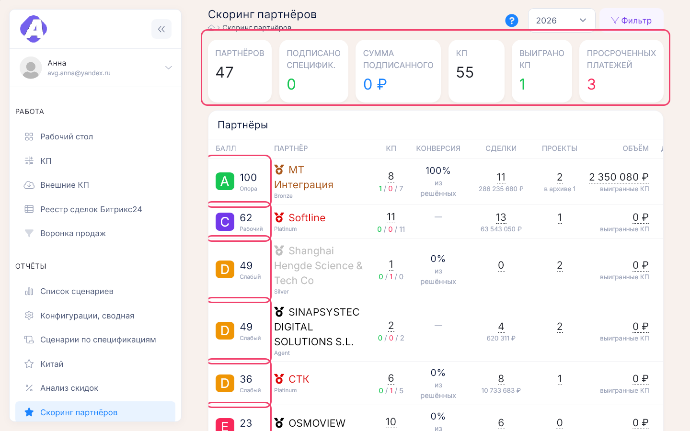
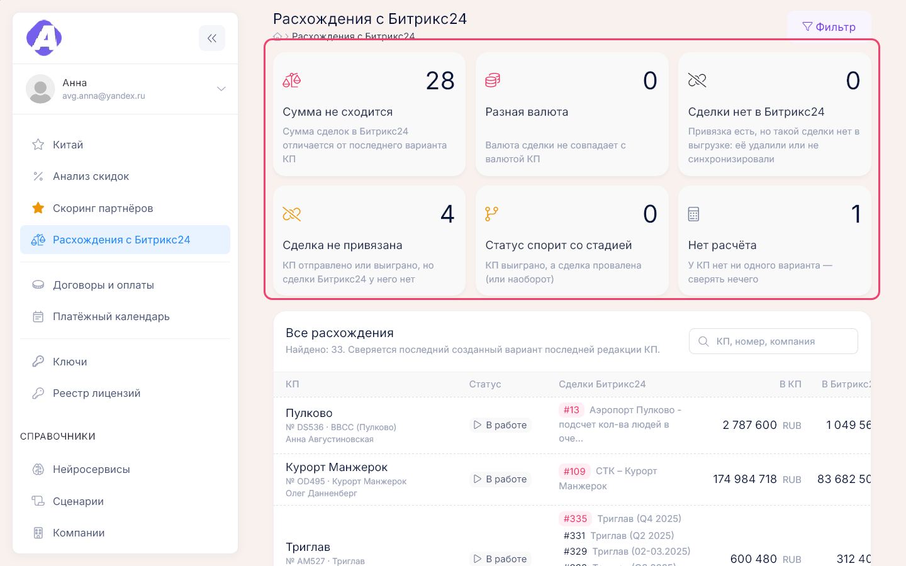

# Отчёты

**Где найти:** раздел меню «Отчёты». «Договоры и оплаты» и «Платёжный календарь» —
[09-contracts-payments.md](09-contracts-payments.md), «Ключи» и «Реестр лицензий» —
[10-licenses.md](10-licenses.md). Остальные отчёты — на этой странице.

| Вопрос | Отчёт |
|---|---|
| Кто из партнёров сильнее — отчёт по партнёрам | «Скоринг партнёров» |
| Где скидка в КП выше нормы | «Анализ скидок» |
| Где КП расходятся со сделками Битрикс24 | «Расхождения с Битрикс24» |
| Какие сценарии купил клиент | «Сценарии по спецификациям» |
| Что входит в спецификации, выгрузка в PDF или Excel | «Конфигурации, сводная» |
| Ключи для отчётности по Китаю | «Китай» |
| Какие сценарии есть в прайсе | «Список сценариев» |

## Оценить партнёров — отчёт по партнёрам

«Отчёты» → «Скоринг партнёров» (`/analytics/partners`) → выберите год или «все годы».

Партнёры отсортированы по баллу 0–100 с буквой A–E. В строке — КП и конверсия, сделки Битрикс24,
проекты, объём выигранных КП, подписанные спецификации, платежи с просрочкой и средний срок от КП
до договора. Найти партнёра — «Фильтр»: грейд или название. Наведите на балл, чтобы увидеть место
в рейтинге по годам и из чего он сложился.

Как считается балл — в разделе «Как это устроено: скоринг партнёров».

## Разобрать показатели одного партнёра

В строке партнёра нажмите «По годам» или любую цифру: КП, сделки, проекты, объём, договор, платежи.
Откроется статистика партнёра — показатели и место по годам и списки за каждой цифрой: все КП,
выигранные КП, спецификации, платежи (оплачено, просрочено, ожидается), сделки, проекты. Оттуда же
можно перейти в карточку партнёра.

«нет сопоставления» в колонке сделок — партнёр не связан с компанией Битрикс24, поэтому сделок
у него ноль ([07-partners.md](07-partners.md)).

## Найти КП со скидкой выше нормы

«Отчёты» → «Анализ скидок» → год → «Фильтр» → «только выделенные». Выделенные КП — красные строки;
красный треугольник в конце строки показывает, какой порог превышен.

В строке видно скидку заказчику (процент от прайса), скидку партнёру (процент от цены заказчика),
совокупную скидку и её отклонение от средней по грейду партнёра.

## Проверить, сходятся ли КП со сделками Битрикс24

1. «Отчёты» → «Расхождения с Битрикс24».
2. Нажмите карточку вида расхождения — останутся только такие КП; повторный клик снимает отбор.
   Сузить по статусу КП или менеджеру — «Фильтр».
3. Название КП ведёт в сводную информацию по сделке. Привязку сделки исправляют в портале
   ([03-proposals.md](03-proposals.md)), сумму и стадию сделки — в Битрикс24.

## Узнать, какие сценарии купил клиент

«Отчёты» → «Сценарии по спецификациям» — по партнёрам и компаниям: КП, договор, спецификация,
сценарий и нейросервис.

- Красное «…» в колонке «КП» — к договору не прикреплено КП.
- Розовые ячейки сценария и нейросервиса — сценарий вписан в спецификацию вручную, не из
  справочника, поэтому нейросервис неизвестен.

## Посмотреть состав спецификаций и выгрузить его

«Отчёты» → «Конфигурации, сводная» — по каждой лицензионной спецификации: конфигурации объекта
и сценарии. Выгрузка — значки PDF и Excel в шапке.

Чтобы убрать спецификацию из отчёта, переключите «Все спецификации», снимите её флажок и нажмите
«Сохранить». Вернуть — поставить флажок обратно.

## Подготовить отчёт для Китая

«Отчёты» → «Китай» → проверьте курсы и валюту отчёта (по умолчанию CNY) → отметьте ключи →
«Скачать отчёт». Скачается Excel с отмеченными ключами по указанным курсам.

В отчёт попадают ключи, срок которых ещё не закончился. Курсы подставляются на начало текущей
недели, их можно поправить. Сумма по ключу — минимальная сумма варианта КП по договору спецификации
в валюте отчёта; нейросервисы — строки из комментария ключа.

## Посмотреть список сценариев прайса

«Отчёты» → «Список сценариев» — все активные сценарии с нейросервисами одной таблицей, для печати
и сверки. Сами сценарии правятся в справочнике — [12-references.md](12-references.md).

## Как это устроено: скоринг партнёров

Балл складывается из пяти частей. Каждая считается относительно лучшего результата в выборке,
итог приводится к лидеру — у лучшего партнёра всегда 100.

| Часть балла | Вес |
|---|---|
| Сумма подписанных спецификаций | 35 |
| Количество проектов | 25 |
| Конверсия решённых КП | 25 |
| Количество сделок Битрикс24 | 10 |
| Доля просроченных платежей (чем меньше, тем выше) | 5 |

- Балл года сглажен по трём годам: текущий — 75 %, прошлый — 20 %, позапрошлый — 5 %. Так партнёр
  с крупным договором прошлого года не выглядит пустым.
- Спецификации относятся к году по своей дате, сделки — по дате создания в Битрикс24 (на любой
  стадии), проекты — по дате начала, архивные тоже считаются.
- Конверсия — доля выигранных среди решённых КП; КП в работе не учитываются.
- Срок «КП → договор» — от последнего КП до даты спецификации; жёлтым — КП оформлено позже
  спецификации.

| Буква | Балл | Подпись |
|---|---|---|
| A | 80–100 | «Опора» |
| B | 65–79 | «Надёжный» |
| C | 50–64 | «Рабочий» |
| D | 35–49 | «Слабый» |
| E | 0–34 | «Плохо» |

## Как это устроено: анализ скидок

- Считается последний созданный вариант последней редакции КП — тот, что ушёл заказчику.
- КП выделяется, если совокупная скидка выше 40 % или больше средней по грейду партнёра более чем
  на 5 процентных пунктов. Пороги задаёт администратор, действующие значения написаны под таблицей.
- Суммы — в валюте КП, проценты сравнимы между собой. Если для части КП нет курса валюты, над
  таблицей появится предупреждение: такие КП посчитаны один к одному.

## Как это устроено: расхождения с Битрикс24

Сверяется последний созданный вариант последней редакции КП с привязанными к нему сделками. Валюты
не пересчитываются: разная валюта считается ошибкой. По умолчанию показаны только КП с расхождениями.

| Вид | Что означает |
|---|---|
| «Сумма не сходится» | сумма сделок отличается от суммы КП больше чем на допуск (1 единица валюты, задаёт администратор) |
| «Разная валюта» | валюта сделки не совпадает с валютой КП |
| «Сделки нет в Битрикс24» | привязка есть, а сделки нет в выгрузке: её удалили или ещё не синхронизировали |
| «Сделка не привязана» | КП в работе или выиграно, а сделки у него нет |
| «Статус спорит со стадией» | КП выиграно, а сделка провалена, или наоборот |
| «Нет расчёта» | у КП нет ни одного варианта — сверять нечего |

## Частые вопросы

- **Где найти отчёт по партнёрам?** — «Отчёты» → «Скоринг партнёров» (`/analytics/partners`):
  балл, КП, сделки, проекты, договоры и платежи каждого партнёра. По одному партнёру — «По годам».
- **Где посмотреть скоринг?** — Там же; как считается балл — значок «?» в шапке отчёта.
- **Что значат буквы A–E?** — A «Опора» 80–100, B «Надёжный» 65–79, C «Рабочий» 50–64,
  D «Слабый» 35–49, E «Плохо» 0–34.
- **Почему у партнёра ноль сделок в скоринге?** — Партнёр не сопоставлен с компанией Битрикс24
  ([07-partners.md](07-partners.md)).
- **Какой отчёт показывает договоры и оплаты?** — «Договоры и оплаты» и «Платёжный календарь»,
  [09-contracts-payments.md](09-contracts-payments.md).
- **Где ключи?** — «Отчёты» → «Ключи» и «Реестр лицензий», [10-licenses.md](10-licenses.md).
- **Где увидеть, какие сценарии купил клиент?** — «Отчёты» → «Сценарии по спецификациям».
- **Где состав спецификаций в PDF или Excel?** — «Отчёты» → «Конфигурации, сводная».
- **Почему КП красное в «Анализе скидок»?** — Скидка выше 40 % или выше средней по грейду больше
  чем на 5 п.п.; точная причина — по треугольнику в конце строки.
- **Где проверить, сходятся ли суммы КП и сделок?** — «Отчёты» → «Расхождения с Битрикс24»,
  вид «Сумма не сходится».
- **Как получить отчёт для Китая?** — «Отчёты» → «Китай» → отметить ключи → «Скачать отчёт».
