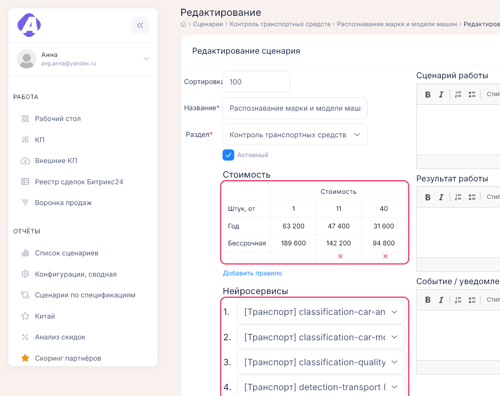
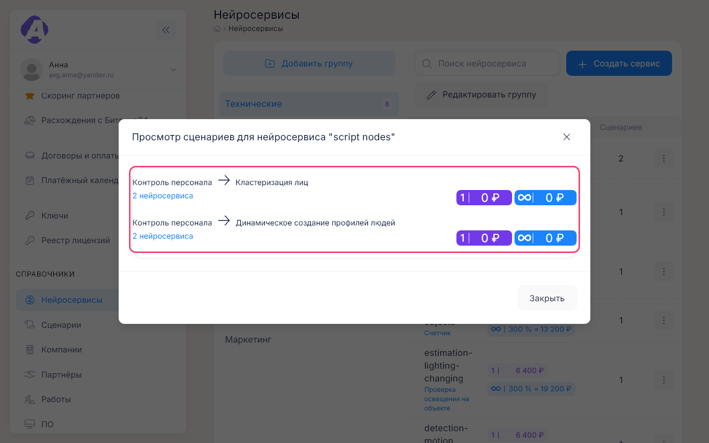
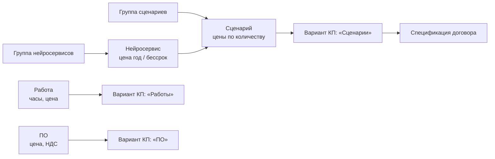

# Справочники: нейросервисы, сценарии, работы, ПО

**Где найти:** «Справочники» → «Нейросервисы» (`/neuroservice`), «Сценарии» (`/scenario`),
«Работы» (`/works`), «ПО» (`/softwares`).
Это прайс портала: из сценариев, работ и ПО собираются варианты [КП](03-proposals.md). Изменения
действуют на новые расчёты — уже созданные КП не пересчитываются.
Создавать, менять и удалять позиции можно только с правом на это; без него кнопок правки нет.

## Изменить цену сценария

«Сценарии» → найдите сценарий (группа слева или «Поиск сценария» по всем группам) → «⋮» →
«Редактировать» → таблица «Стоимость».

Цена задаётся за год и бессрочно для каждого порога количества «Штук, от»; первый порог — 1.
Чтобы при большом количестве было дешевле, нажмите «Добавить правило» и укажите новый порог.

## Задать цену нейросервиса

«Нейросервисы» → «⋮» → «Редактировать» → «Стоимость»: за год и бессрочно. Бессрочную цену можно
не указывать — тогда она считается от годовой по общему коэффициенту, в списке это видно как
«N % = сумма».

## Добавить сценарий в прайс

1. «Сценарии» → выберите группу → «Создать сценарий».
2. Укажите название, группу («Раздел») и цены по порогам.
3. Соберите состав из нейросервисов. Сценарий без нейросервисов помечается «Нет добавленных
   нейросервисов!», а его группа — красным счётчиком.
4. Заполните тексты «Сценарий работы», «Результат работы», «Событие / уведомление» — они попадают в КП.

Флажок «Активный» оставьте включённым, иначе сценарий не предложат в КП.

## Скрыть устаревший сценарий из КП

Редактирование сценария → снимите «Активный». Сценарий пропадёт из выбора в новых КП и из отчёта
«Список сценариев». В КП, где он уже есть, он останется. В справочнике его видно с переключателем
«Показывать неактивные» — с красной пометкой «[!]».

## Узнать, в какие сценарии входит нейросервис

«Нейросервисы» → число в колонке «Сценариев». У каждого сценария в списке раскрывается состав,
текущий нейросервис выделен красным.

## Разобраться со сценарием «До выяснения»

Жёлтая строка «Содержит нейросервис "До выяснения"» значит, что в составе сценария стоит служебная
заглушка. Откройте сценарий и замените её настоящим нейросервисом.

## Добавить работу или ПО в прайс

«Работы» или «ПО» → «Добавить».

- У работы «Группа» — свободный текст, по нему работы группируются в списке.
- У ПО отметьте «НДС включено», если цена уже с НДС.
- «Расширение содержание» — подробное описание позиции, «Примечание» — служебная пометка; обе видны
  по кнопке «Посмотреть» и отмечены «+» в таблице.

## Удалить позицию или группу

«⋮» → «Удалить» — удаление необратимо. Группу нейросервисов или сценариев можно удалить только пустой:
сначала перенесите или удалите её записи, затем «Редактировать группу» → «Удалить».

## Как это устроено

- **В КП** блок «Сценарии» берёт сценарий с его ценами по порогам, блоки «ПО» и «Работы» — позиции
  своих справочников; работа приносит длительность и цену. Альтернативное название сценария,
  заданное в КП, показывается заказчику вместо названия из справочника.
- **Неактивные сценарии** в КП не предлагаются — кроме уже добавленных в это КП.
- **Поиск** в нейросервисах и сценариях ищет сразу по всем группам.
- **Отчёты по справочникам:** «Список сценариев» и «Сценарии по спецификациям»; «Анализ скидок»
  считает скидки по тем же блокам — [11-reports.md](11-reports.md).

## Частые вопросы

- **Где справочник сценариев, нейросервисов, работ, ПО?** — Раздел меню «Справочники».
- **Как изменить цену сценария?** — «Сценарии» → «⋮» → «Редактировать» → «Стоимость». Созданные
  КП не пересчитаются.
- **Где цена нейросервиса за год и бессрочно?** — «Нейросервисы» → «⋮» → «Редактировать» →
  «Стоимость».
- **Почему у сценария «Нет добавленных нейросервисов!» и красный счётчик у группы?** — В сценарии
  нет ни одного нейросервиса; добавьте их в редактировании.
- **Что значит «Содержит нейросервис "До выяснения"»?** — Состав сценария не уточнён: замените
  заглушку настоящим нейросервисом.
- **Почему сценария нет при создании КП?** — Он неактивен или ещё не создан; проверьте с
  переключателем «Показывать неактивные».
- **Как удалить группу?** — Только пустую: сначала уберите из неё записи.
- **В какие сценарии входит нейросервис?** — «Нейросервисы» → число в колонке «Сценариев».
