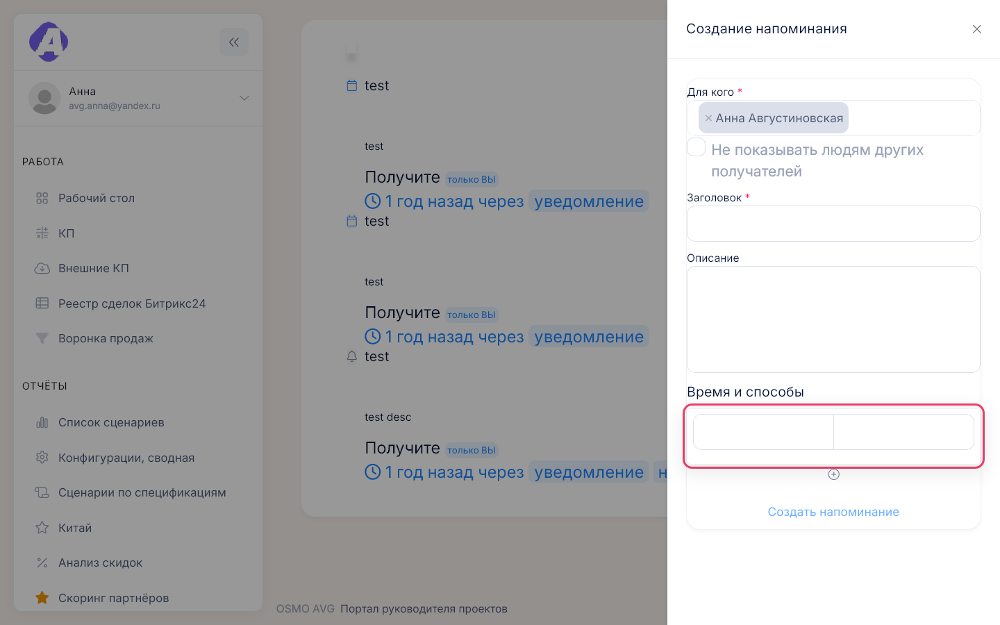
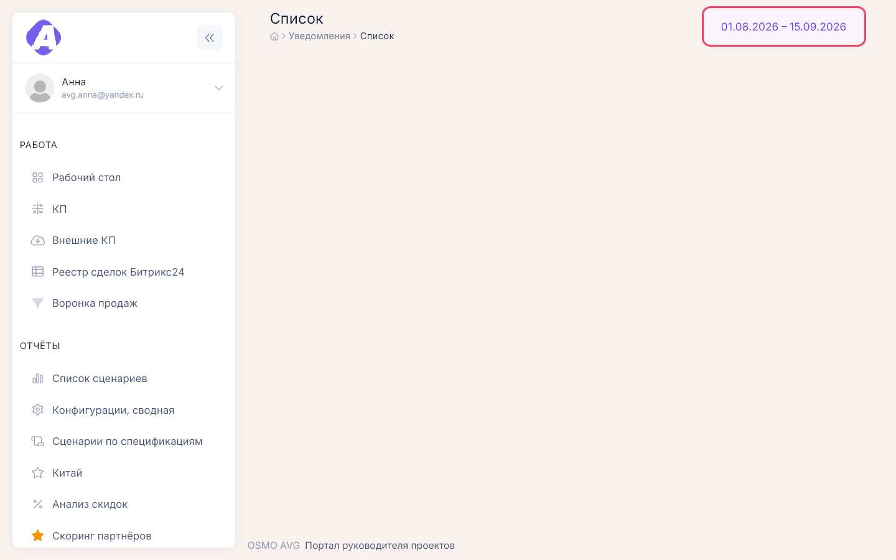

# Личные инструменты

**Где найти:** меню под аватаром в левом меню — «Мой профиль», «Напоминания» (`/reminders`),
«Календарь» (`/calendar`), «Уведомления», «История уведомлений» (`/notify/list`). Заметки —
виджет «Блокнот» на [рабочем столе](02-desktop.md).
Здесь напоминания себе и коллегам, личный календарь, заметки и уведомления портала.

## Напомнить себе или коллеге

1. Если напоминание про конкретное КП, событие календаря или заметку, начните с колокольчика
   на этом объекте — из напоминания потом можно будет перейти к нему. Иначе — «Напоминания» → «+».
2. Укажите, когда напомнить и как: уведомлением в портале, в Телеграм или на почту — нужен хотя бы
   один способ. Чтобы напомнить несколько раз, добавьте моменты кнопкой «+» под «Время и способы».
3. Чтобы напомнить коллеге, выберите его в «Для кого». Поле есть, только если у вас есть подчинённые
   (см. «Назначить руководителей и подчинённых»). «Не показывать людям других получателей» скрывает
   от каждого, кому ещё ушло напоминание.

## Изменить или удалить напоминание

«⋮» на карточке напоминания → «Редактировать» или «Удалить».

- Менять и удалять напоминание может только автор.
- Пока ни один момент не сработал, можно менять всё. После первой отправки можно только добавлять
  новые моменты, а удалить напоминание нельзя.

## Найти напоминания по КП или другому объекту

Ссылка «N напоминаний» на карточке объекта или «⋮» → «Отфильтровать» у напоминания — откроется
список только по этому объекту. Снять отбор — красная кнопка у плашки «Фильтр».

## Добавить событие в календарь

«Календарь» → «Добавить событие». Срок задаётся целым днём, диапазоном дат или временем начала
и конца (минуты округляются до десяти).

Дата пока неизвестна — выберите «На будущее»: событие попадёт в «Нераспределенные события» слева,
оттуда его потом перетаскивают в нужный день.

## Перенести событие

Перетащите событие на другой день или, в режимах «Неделя» и «День», растяните за край — изменение
сохраняется сразу. Остальное меняется через клик по событию → «Редактировать».

## Напомнить о событии

Клик по событию → колокольчик в блоке «Напоминания». У события с напоминаниями в сетке видно
их число.

## Скачать расписание в PDF

«Календарь» → «Список» — скачается `schedule.pdf` с ближайшими событиями. Если ближайших событий
нет, файл не сформируется.

## Завести заметку

Виджет «Блокнот» на рабочем столе → ссылка добавления. Звёздочка поднимает заметку в избранное,
вверх списка; колокольчик ставит напоминание по заметке.

Отдельной страницы заметок нет. Если виджета «Блокнот» на столе нет, добавьте его из библиотеки —
[02-desktop.md](02-desktop.md). Для одного стикера с текстом есть виджет «Заметка».

## Прочитать и очистить уведомления

Аватар → «Уведомления». Клик по уведомлению со ссылкой открывает связанный объект. «Очистить»
переносит все непрочитанные в прошлые, крестик у строки — одно уведомление.

## Найти старые уведомления

«История уведомлений» → кнопка с датами справа в шапке: 7 или 30 дней, прошлый или этот месяц,
этот год или свой период.

## Назначить руководителей и подчинённых

«Мой профиль» → «Управлять» в блоке «Руководители» или «Подчинённые». Кнопка есть только у тех,
кому это разрешено. От этой связи зависит, кому руководитель может ставить напоминания.

Имя, должность и почта в профиле в портале не меняются — обратитесь к администратору.

## Как это устроено

- **Моменты напоминания:** синие часы — ещё впереди, серая галочка — уже отправлено. «Создано
  автоматически» — напоминание поставил сам портал.
- **Точка на вашем аватаре** — есть непрочитанные уведомления; мигает — пришли новые.
- **Зелёная точка на аватаре в профиле** — сотрудник сейчас в портале.

## Частые вопросы

- **Где мой профиль?** — Аватар в левом меню → «Мой профиль».
- **Как изменить фото или должность?** — В портале никак; обратитесь к администратору.
- **Как напомнить коллеге?** — «Для кого» при создании напоминания; поле есть, только если
  коллега — ваш подчинённый.
- **Напоминание не удаляется.** — Оно уже сработало хотя бы раз; можно только добавить новые
  моменты.
- **Куда делось событие без даты?** — В «Нераспределенные события» слева в календаре; перетащите
  его в нужный день.
- **Где все мои заметки?** — В виджете «Блокнот» на рабочем столе.
- **Где старые уведомления?** — «История уведомлений»; расширьте период кнопкой с датами.
