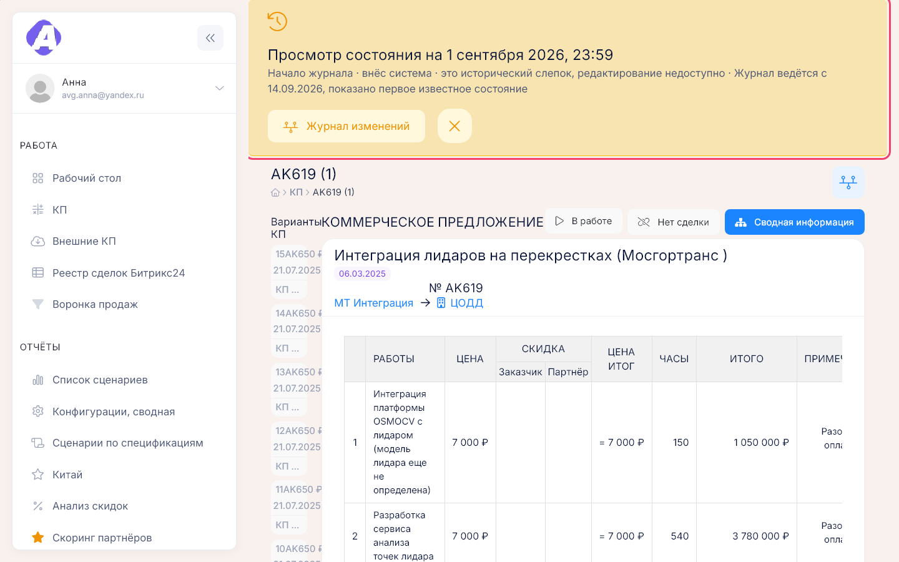
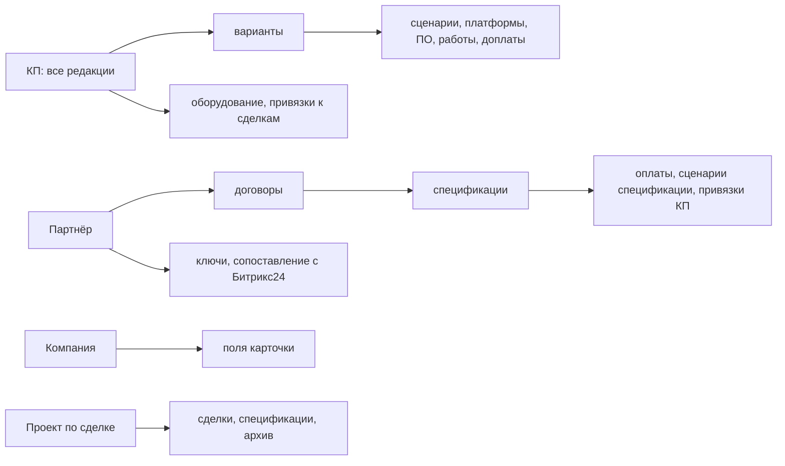

# Журнал изменений

**Где найти:** кнопка «Журнал изменений» (значок ленты времени) на карточках КП, партнёра
и компании и внизу окна проекта по сделке. Последние события по всем объектам — виджет «Журнал
изменений» на [рабочем столе](02-desktop.md).
Журнал показывает, кто, когда и что изменил, поле за полем со старым и новым значением, и
открывает карточку такой, какой она была в прошлом.
Нужно право «Видит журнал изменений» (выдаёт администратор); без него кнопок журнала нет.

## Узнать, кто и когда изменил поле

1. Карточка объекта → «Журнал изменений».
2. «Фильтр» → «Поле», например «Цена» или «Итого». Можно сузить по «Пользователю» и «Событию».

У каждого события — автор, время, «Было» и «Стало». Фильтр сохраняется в адресе страницы —
ссылку можно отправить коллеге.

У КП один журнал на все редакции, переключать редакции не нужно.

## Найти историю спецификации, оплаты или ключа

Отдельного журнала у них нет — они в журнале партнёра: карточка партнёра → «Журнал изменений» →
«Фильтр» → поле из группы спецификации, оплаты или ключа.

## Посмотреть карточку на прошлую дату

- В журнале: «Состояние на конец дня» у нужной даты или «Открыть состояние на этот момент» под
  событием.
- Или допишите к адресу карточки `?at=ГГГГ-ММ-ДД` — откроется состояние на конец этого дня.

Над карточкой появится жёлтая полоса «Просмотр состояния на …»: это слепок, изменить его нельзя,
кнопки правки скрыты. Крестик на полосе возвращает к текущему состоянию.

Так можно открыть КП, партнёра и компанию. У проекта по сделке прошлого состояния нет — только
лента изменений.

## Как это устроено

- **Что в какой журнал попадает:**
  - КП — поля, варианты и их позиции, оборудование, привязки к сделкам, статус;
  - партнёр — карточка, договоры, спецификации, оплаты, сценарии спецификаций, прикрепление КП
    к спецификациям, ключи, сопоставление с Битрикс24;
  - компания — только поля карточки;
  - проект по сделке — партнёр, заказчик, дата начала, пилот и срок, комментарий, архив, сделки
    и спецификации.
- **Одно сохранение — одно событие.** Даже если форма пересоздаёт строки целиком (например, график
  оплат), в журнале будет одно «Изменение» с изменёнными полями, а не «удалено» и «создано».
- **Жирная строка** — правка пользователя; **курсивная со сдвигом** — итоги, НДС и цены со скидкой,
  которые портал пересчитал следом.
- **Автор «система»** — изменение сделал портал сам: синхронизация или служебная операция.
- **«Начало журнала»** — первый слепок объекта; раньше него изменения не записывались. Состояние на
  более раннюю дату покажет этот слепок с пометкой «Журнал ведётся с …».
- **Без права на журнал** ссылка на прошлое состояние открывает текущую карточку.

## Частые вопросы

- **Кто и когда поменял сумму в КП?** — Карточка КП → «Журнал изменений» → «Фильтр» → поле «Цена»
  или «Итого».
- **Почему у меня нет кнопки «Журнал изменений»?** — Нет права «Видит журнал изменений»;
  обратитесь к администратору.
- **Где история спецификации или оплаты?** — В журнале партнёра, которому принадлежит договор.
- **Почему одно изменение дало несколько строк?** — Жирная строка — правка, курсивные — итоги,
  пересчитанные следом. Это одно событие.
- **Можно посмотреть, как выглядело КП месяц назад?** — Да: «Состояние на конец дня» в журнале
  или `?at=ГГГГ-ММ-ДД` в адресе карточки. Для проектов по сделкам — нет.
- **Журнал начинается с «Начало журнала», а объект старше.** — Изменения до первого слепка
  не записывались.
- **Что за события от «системы»?** — Изменения, которые портал сделал без участия пользователя.
