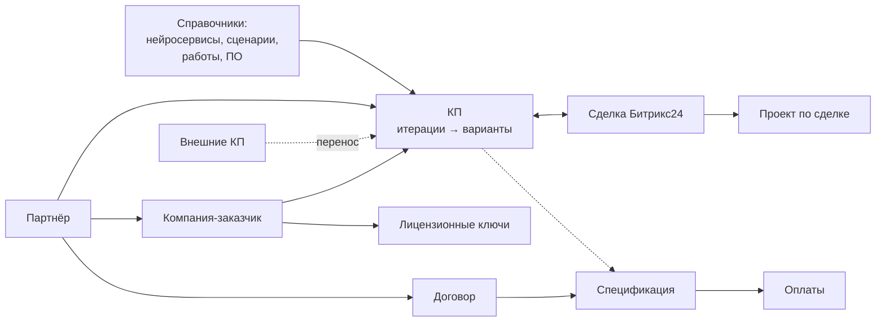

# Портал OSMO — руководство пользователя

Портал OSMO — внутренняя система компании для работы с коммерческими предложениями (КП),
партнёрами и заказчиками, договорами и оплатами, лицензионными ключами и данными
CRM Битрикс24. Это руководство описывает все разделы портала, которые видит обычный
сотрудник. Административные функции здесь не описаны.

Как читать: у каждой страницы одинаковая структура — **где найти** (пункт меню и адрес),
**для чего**, **кому доступно**, что на экране, пошаговые инструкции «Как …», связи с
другими разделами и **частые вопросы**. Незнакомый термин — в [глоссарии](00-glossary.md).
Быстрый поиск «где что лежит» — в [FAQ](15-faq.md).

## Оглавление

| № | Страница | О чём |
|---|---|---|
| 00 | [Глоссарий](00-glossary.md) | термины портала: КП, итерация, вариант, партнёр, компания, спецификация, проект… |
| 01 | [Начало работы](01-interface.md) | вход, где какой раздел, поиск и фильтры, сообщения портала, работа с телефона |
| 02 | [Рабочий стол](02-desktop.md) | главная страница: столы, виджеты, библиотека, размеры и настройки виджетов |
| 03 | [КП](03-proposals.md) | список КП, создание, карточка, итерации и варианты, статусы, PDF и Excel, привязка к сделке |
| 04 | [Внешние КП](04-external-proposals.md) | КП из внешнего генератора: просмотр, синхронизация, перенос во внутреннее КП |
| 05 | [Сделки Битрикс24](05-bitrix-deals.md) | реестр сделок, воронка продаж, проблемы в сделках, выгрузка |
| 06 | [Проекты по сделкам](06-deal-projects.md) | проекты по выигранным сделкам: создание, привязка сделок, архив |
| 07 | [Партнёры](07-partners.md) | завести партнёра, сопоставить с Битрикс24, сделки, проекты и договоры партнёра |
| 08 | [Компании](08-companies.md) | справочник заказчиков, карточка компании, проекты компании и конфигурации |
| 09 | [Договоры и оплаты](09-contracts-payments.md) | договоры, спецификации, контроль оплат, отчёт «Договоры и оплаты», платёжный календарь |
| 10 | [Ключи и лицензии](10-licenses.md) | лицензионные ключи компаний, отчёт «Ключи», реестр лицензий |
| 11 | [Отчёты](11-reports.md) | сценарии, конфигурации, Китай, анализ скидок, скоринг партнёров, расхождения с Битрикс24 |
| 12 | [Справочники](12-references.md) | нейросервисы, сценарии, работы, ПО — из чего собирается КП |
| 13 | [Личные инструменты](13-personal.md) | профиль, календарь, напоминания, заметки, уведомления |
| 14 | [Журнал изменений](14-entity-log.md) | история правок карточек и состояние на дату |
| 15 | [FAQ: где найти…](15-faq.md) | короткие ответы на типовые вопросы со ссылками на страницы |

## Карта меню портала

<table>
<thead>
<tr><th>Меню</th><th>Пункт</th><th>Страница руководства</th></tr>
</thead>
<tbody>
<tr><td rowspan="5">«Работа»</td><td>«Рабочий стол»</td><td><a href="02-desktop.md">02</a></td></tr>
<tr><td>«КП»</td><td><a href="03-proposals.md">03</a></td></tr>
<tr><td>«Внешние КП»</td><td><a href="04-external-proposals.md">04</a></td></tr>
<tr><td>«Реестр сделок Битрикс24»</td><td><a href="05-bitrix-deals.md">05</a>, проекты — <a href="06-deal-projects.md">06</a></td></tr>
<tr><td>«Воронка продаж»</td><td><a href="05-bitrix-deals.md">05</a></td></tr>
<tr><td rowspan="3">«Отчёты»</td><td>«Список сценариев», «Конфигурации, сводная», «Сценарии по спецификациям», «Китай», «Анализ скидок», «Скоринг партнёров», «Расхождения с Битрикс24»</td><td><a href="11-reports.md">11</a></td></tr>
<tr><td>«Договоры и оплаты», «Платёжный календарь»</td><td><a href="09-contracts-payments.md">09</a></td></tr>
<tr><td>«Ключи», «Реестр лицензий»</td><td><a href="10-licenses.md">10</a></td></tr>
<tr><td rowspan="3">«Справочники»</td><td>«Партнёры»</td><td><a href="07-partners.md">07</a></td></tr>
<tr><td>«Компании»</td><td><a href="08-companies.md">08</a></td></tr>
<tr><td>«Нейросервисы», «Сценарии», «Работы», «ПО»</td><td><a href="12-references.md">12</a></td></tr>
<tr><td>Профиль (левое меню)</td><td>«Мой профиль», «Напоминания», «Календарь», «Уведомления», «История уведомлений», «Цветовая схема»</td><td><a href="13-personal.md">13</a>, <a href="01-interface.md">01</a></td></tr>
</tbody>
</table>

## Как устроены данные

Партнёр продаёт решение заказчику (компании): для него делается КП, в Битрикс24 ведётся
сделка, по выигранной сделке появляется проект, с партнёром подписываются договор и
спецификация, по спецификации приходят оплаты; заказчику выдаются лицензионные ключи.
Отчёты и рабочий стол собирают эти данные в сводки.
